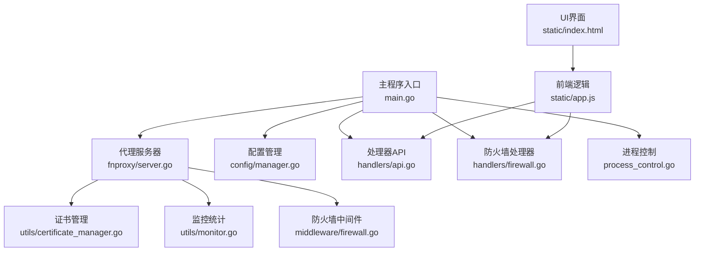
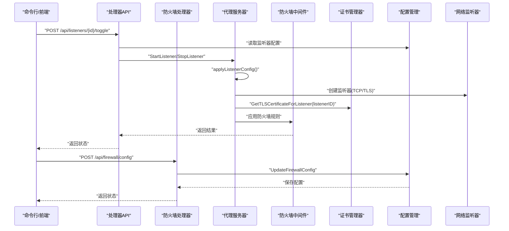
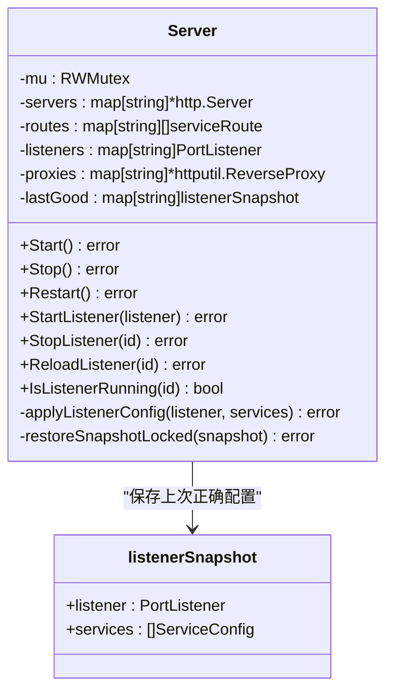
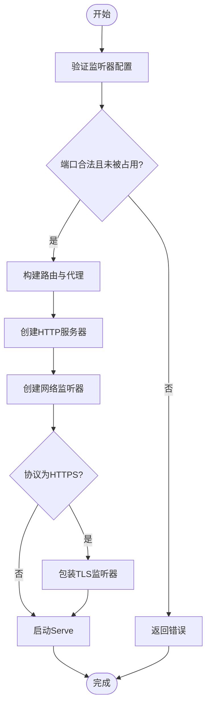
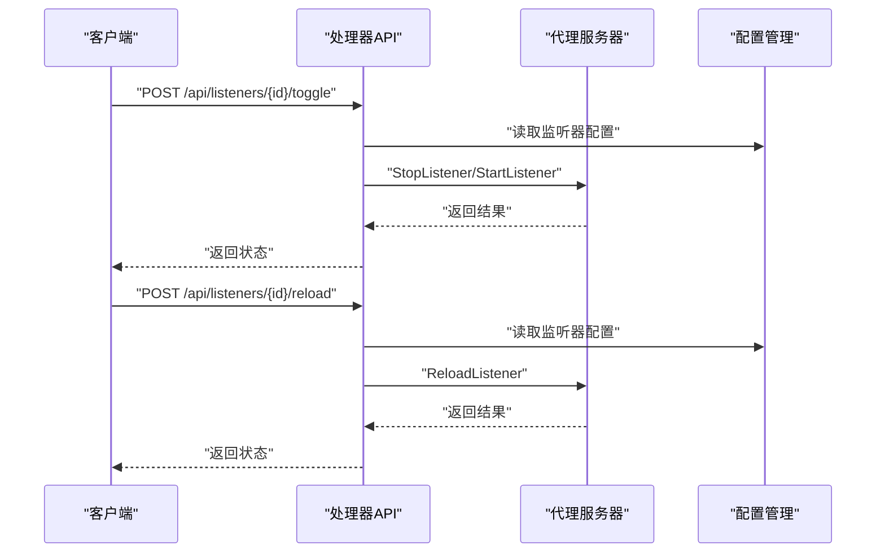
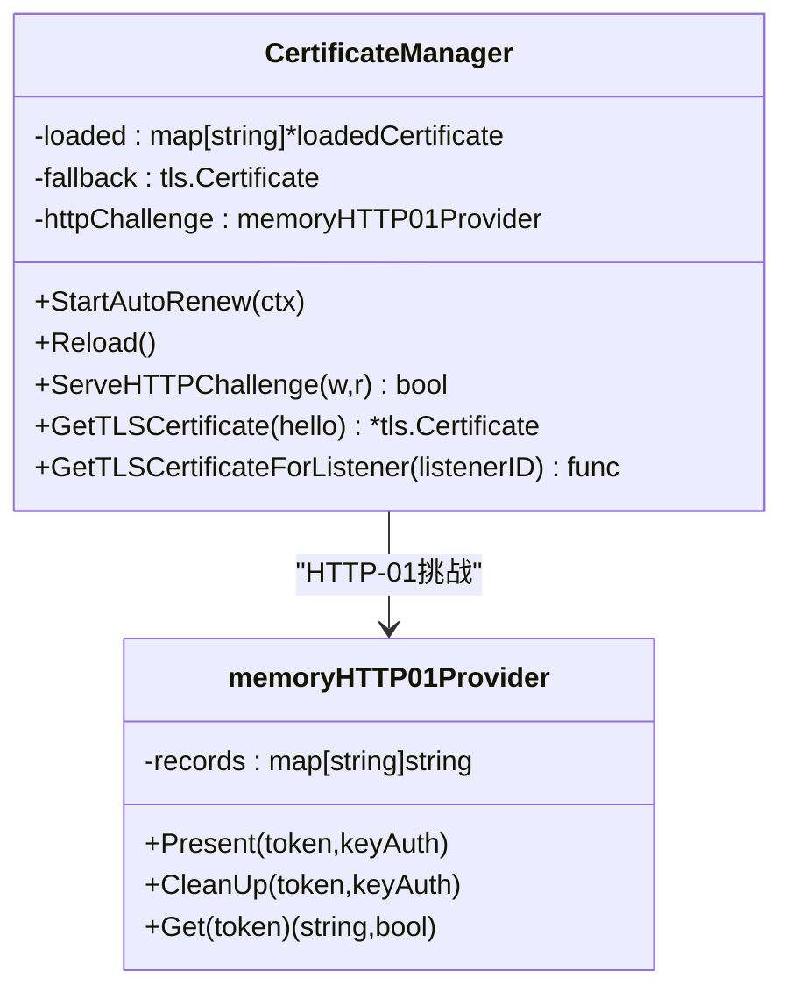
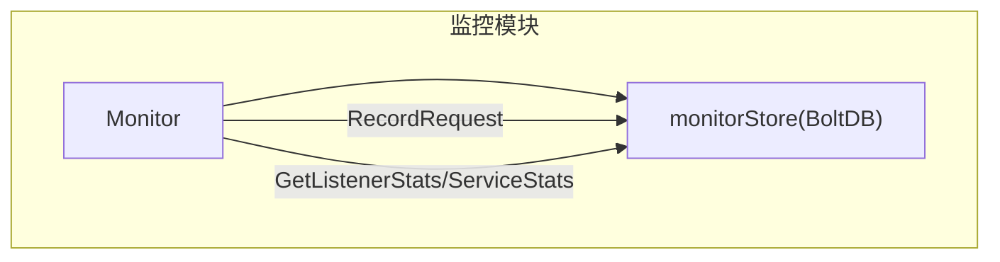
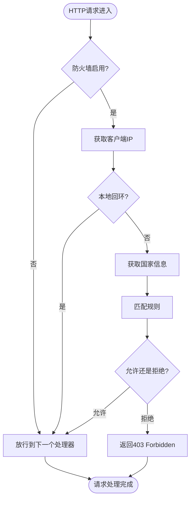
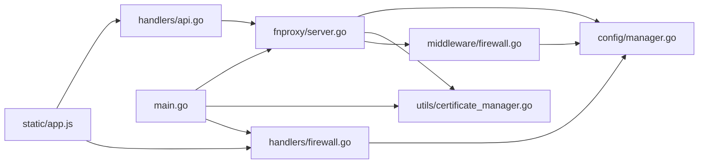

# 监听器管理

<cite>
**本文引用的文件**
- [main.go](file://src/main.go)
- [server.go](file://src/fnproxy/server.go)
- [manager.go](file://src/config/manager.go)
- [models.go](file://src/models/models.go)
- [api.go](file://src/handlers/api.go)
- [firewall.go](file://src/handlers/firewall.go)
- [firewall.go](file://src/middleware/firewall.go)
- [certificate_manager.go](file://src/utils/certificate_manager.go)
- [monitor.go](file://src/utils/monitor.go)
- [process_control.go](file://src/process_control.go)
- [index.html](file://src/static/index.html)
- [app.js](file://src/static/app.js)
- [ui-listener-fixes-20260311.md](file://documents/ui-listener-fixes-20260311.md)
</cite>

## 更新摘要
**所做更改**
- 集成防火墙中间件，新增网络安全防护能力
- 改进UI交互体验，统一视觉风格和交互逻辑
- 更新命名约定为"网站管理"，提升用户体验一致性
- 增强监听器状态管理和错误处理机制
- 完善OAuth认证和安全审计功能

## 目录
1. [简介](#简介)
2. [项目结构](#项目结构)
3. [核心组件](#核心组件)
4. [架构总览](#架构总览)
5. [详细组件分析](#详细组件分析)
6. [防火墙中间件集成](#防火墙中间件集成)
7. [UI交互体验改进](#ui交互体验改进)
8. [命名约定统一](#命名约定统一)
9. [依赖分析](#依赖分析)
10. [性能考虑](#性能考虑)
11. [故障排查指南](#故障排查指南)
12. [结论](#结论)
13. [附录](#附录)

## 简介
本文件围绕代理服务器的"监听器管理"能力进行系统化文档化，重点覆盖以下方面：
- 监听器的启动、停止、重启与热重载机制
- 监听器配置的验证流程、TLS证书绑定与网络监听器创建
- 服务器启动流程、状态管理、错误处理与回滚机制
- 监听器ID映射、内存缓存与并发安全设计
- 监听器配置参数说明、启动顺序控制与故障恢复方案
- **新增** 防火墙中间件集成与网络安全防护
- **新增** UI交互体验改进与视觉统一
- **新增** 命名约定统一为"网站管理"
- 实际代码示例与配置最佳实践

## 项目结构
该项目采用模块化组织，监听器管理涉及如下关键模块：
- 主程序入口负责进程控制、管理后台监听与代理服务器启动
- 代理服务器模块负责监听器生命周期、路由构建、TLS绑定与热更新
- 配置管理模块负责持久化与内存配置的读写，新增防火墙配置管理
- 处理器模块负责对外暴露REST API，实现监听器的增删改查、启停与热重载
- **新增** 防火墙处理器模块，提供网络安全规则管理接口
- 证书管理模块负责ACME证书加载、HTTP-01挑战响应与按监听器ID的证书选择
- 监控模块负责运行时统计与日志记录
- **新增** UI模块，提供统一的视觉风格和交互体验

**图表来源**
- [main.go:140-184](file://src/main.go#L140-L184)
- [server.go:183-218](file://src/fnproxy/server.go#L183-L218)
- [manager.go:35-72](file://src/config/manager.go#L35-L72)
- [api.go:140-154](file://src/handlers/api.go#L140-L154)
- [firewall.go:21-68](file://src/handlers/firewall.go#L21-L68)
- [firewall.go:13-56](file://src/middleware/firewall.go#L13-L56)
- [certificate_manager.go:140-151](file://src/utils/certificate_manager.go#L140-151)
- [monitor.go:53-65](file://src/utils/monitor.go#L53-L65)
- [process_control.go:17-28](file://src/process_control.go#L17-L28)
- [index.html:1-200](file://src/static/index.html#L1-L200)
- [app.js:1-200](file://src/static/app.js#L1-L200)

**章节来源**
- [main.go:140-184](file://src/main.go#L140-L184)
- [server.go:183-218](file://src/fnproxy/server.go#L183-L218)
- [manager.go:35-72](file://src/config/manager.go#L35-L72)
- [api.go:140-154](file://src/handlers/api.go#L140-L154)
- [firewall.go:21-68](file://src/handlers/firewall.go#L21-L68)
- [firewall.go:13-56](file://src/middleware/firewall.go#L13-L56)
- [certificate_manager.go:140-151](file://src/utils/certificate_manager.go#L140-151)
- [monitor.go:53-65](file://src/utils/monitor.go#L53-L65)
- [process_control.go:17-28](file://src/process_control.go#L17-L28)
- [index.html:1-200](file://src/static/index.html#L1-L200)
- [app.js:1-200](file://src/static/app.js#L1-L200)

## 核心组件
- 代理服务器（Server）：负责监听器生命周期、动态路由构建、TLS证书绑定、热更新与回滚
- 配置管理（Manager）：负责监听器、服务、证书、**防火墙配置**等配置的持久化与内存缓存
- 处理器API（handlers/api.go）：对外提供监听器的CRUD、启停、热重载等REST接口
- **新增** 防火墙处理器（handlers/firewall.go）：提供防火墙配置和规则管理的REST接口
- **新增** 防火墙中间件（middleware/firewall.go）：在网络请求层面实施访问控制
- 证书管理（utils/certificate_manager.go）：负责证书加载、ACME续签、HTTP-01挑战响应与按监听器ID选择证书
- 监控（utils/monitor.go）：负责运行时统计、日志记录与历史数据查询
- 主程序（main.go）：负责管理后台监听、代理服务器启动、优雅关闭与进程控制
- **新增** UI模块（static/index.html, static/app.js）：提供统一的视觉风格和交互体验

**章节来源**
- [server.go:37-49](file://src/fnproxy/server.go#L37-L49)
- [manager.go:18-21](file://src/config/manager.go#L18-L21)
- [api.go:140-154](file://src/handlers/api.go#L140-L154)
- [firewall.go:21-68](file://src/handlers/firewall.go#L21-L68)
- [firewall.go:13-56](file://src/middleware/firewall.go#L13-L56)
- [certificate_manager.go:126-133](file://src/utils/certificate_manager.go#L126-L133)
- [monitor.go:38-46](file://src/utils/monitor.go#L38-L46)
- [main.go:432-480](file://src/main.go#L432-L480)
- [index.html:1-200](file://src/static/index.html#L1-L200)
- [app.js:1-200](file://src/static/app.js#L1-L200)

## 架构总览
监听器管理的整体流程如下：
- 主程序启动管理后台监听（TCP或Unix Socket），随后启动代理服务器
- 代理服务器根据配置逐个启动监听器，构建动态路由表，并为HTTPS监听器绑定证书
- **新增** 防火墙中间件在网络请求层面实施访问控制
- 处理器API接收外部请求，调用代理服务器执行启停、热重载等操作
- **新增** 防火墙处理器提供网络安全规则管理接口
- 证书管理器按监听器ID选择证书，支持ACME自动续签与HTTP-01挑战
- 监控模块记录运行时统计数据与访问日志

**图表来源**
- [api.go:304-357](file://src/handlers/api.go#L304-L357)
- [server.go:370-425](file://src/fnproxy/server.go#L370-L425)
- [firewall.go:33-68](file://src/handlers/firewall.go#L33-L68)
- [firewall.go:13-56](file://src/middleware/firewall.go#L13-L56)
- [certificate_manager.go:287-306](file://src/utils/certificate_manager.go#L287-L306)
- [manager.go:250-260](file://src/config/manager.go#L250-L260)

## 详细组件分析

### 代理服务器（Server）与监听器生命周期
- 并发安全：使用互斥锁保护监听器集合、路由表、代理缓存与上次正确快照
- 启动流程：遍历配置中的监听器，逐个调用StartListener，内部构建路由、创建HTTP服务器与网络监听器
- 停止流程：Shutdown当前监听器，清理路由、代理与上次正确快照
- 热重载：若监听器已在运行，仅更新路由表与代理，避免重启
- 回滚机制：应用新配置失败时，若存在上次正确快照则回滚到上次状态

**图表来源**
- [server.go:37-49](file://src/fnproxy/server.go#L37-L49)
- [server.go:370-425](file://src/fnproxy/server.go#L370-L425)
- [server.go:435-440](file://src/fnproxy/server.go#L435-L440)

**章节来源**
- [server.go:183-218](file://src/fnproxy/server.go#L183-L218)
- [server.go:228-253](file://src/fnproxy/server.go#L228-L253)
- [server.go:370-425](file://src/fnproxy/server.go#L370-L425)
- [server.go:435-440](file://src/fnproxy/server.go#L435-L440)

### 监听器配置验证与网络监听器创建
- 配置验证：端口范围、协议合法性、与管理后台端口冲突、端口占用检测
- 网络监听器创建：TCP监听；HTTPS时包装TLS监听器，证书由证书管理器按监听器ID选择
- TLS证书绑定：GetTLSCertificateForListener(listenerID)优先匹配服务显式绑定，再按域名匹配，最后回落到默认证书

**图表来源**
- [api.go:64-93](file://src/handlers/api.go#L64-L93)
- [server.go:293-339](file://src/fnproxy/server.go#L293-L339)
- [certificate_manager.go:287-306](file://src/utils/certificate_manager.go#L287-L306)

**章节来源**
- [api.go:64-93](file://src/handlers/api.go#L64-L93)
- [server.go:293-339](file://src/fnproxy/server.go#L293-L339)
- [certificate_manager.go:287-306](file://src/utils/certificate_manager.go#L287-L306)

### 监听器启停与热重载API
- 切换监听器：根据当前运行状态调用StopListener或StartListener，失败时尝试回滚并保存状态
- 热重载监听器：ReloadListener通过StartListener触发，走热更新逻辑
- 服务启停与重排：服务变更时调用ReloadService，监听器启用状态下触发热更新

**图表来源**
- [api.go:304-357](file://src/handlers/api.go#L304-L357)
- [api.go:359-375](file://src/handlers/api.go#L359-L375)
- [server.go:427-433](file://src/fnproxy/server.go#L427-L433)

**章节来源**
- [api.go:304-357](file://src/handlers/api.go#L304-L357)
- [api.go:359-375](file://src/handlers/api.go#L359-L375)
- [server.go:427-433](file://src/fnproxy/server.go#L427-L433)

### 证书管理与TLS绑定
- 证书加载：从配置加载证书，支持导入、ACME与外部配置文件同步
- ACME续签：定时任务扫描到期证书并续签，支持HTTP-01与DNS-01
- HTTP-01挑战：内存HTTP-01提供者，响应/.well-known/acme-challenge/*
- TLS证书选择：按监听器ID优先匹配服务显式绑定，再按域名匹配，最后回落默认证书

**图表来源**
- [certificate_manager.go:126-133](file://src/utils/certificate_manager.go#L126-L133)
- [certificate_manager.go:253-269](file://src/utils/certificate_manager.go#L253-L269)
- [certificate_manager.go:287-306](file://src/utils/certificate_manager.go#L287-L306)

**章节来源**
- [certificate_manager.go:153-182](file://src/utils/certificate_manager.go#L153-L182)
- [certificate_manager.go:218-251](file://src/utils/certificate_manager.go#L218-L251)
- [certificate_manager.go:253-269](file://src/utils/certificate_manager.go#L253-L269)
- [certificate_manager.go:287-306](file://src/utils/certificate_manager.go#L287-L306)

### 监控与运行时统计
- 运行时统计：记录请求量、活动连接数、字节流入/流出、速率窗口内的平均速率
- 访问日志：持久化到本地数据库，支持按监听器/服务过滤查询
- 网络历史：按10分钟聚合24小时网络流量

**图表来源**
- [monitor.go:38-46](file://src/utils/monitor.go#L38-L46)
- [monitor.go:119-189](file://src/utils/monitor.go#L119-L189)
- [monitor.go:253-321](file://src/utils/monitor.go#L253-L321)

**章节来源**
- [monitor.go:119-189](file://src/utils/monitor.go#L119-L189)
- [monitor.go:253-321](file://src/utils/monitor.go#L253-L321)
- [monitor.go:323-355](file://src/utils/monitor.go#L323-L355)

### 配置模型与参数说明
- 监听器模型：包含端口、协议、启用状态、创建/更新时间
- 服务模型：包含端口ID、类型、域名、排序、证书绑定、启用状态、配置对象
- **新增** 防火墙配置模型：包含启用状态、默认拒绝策略、规则列表
- **新增** 防火墙规则模型：包含ID、名称、类型、IP/Country列表、动作、优先级等
- 全局配置：管理后台端口、日志级别、日志文件、日志保留天数、最大访问日志条数、证书配置路径与同步周期

**章节来源**
- [models.go:72-80](file://src/models/models.go#L72-L80)
- [models.go:93-107](file://src/models/models.go#L93-L107)
- [models.go:362-381](file://src/models/models.go#L362-L381)
- [models.go:346-374](file://src/models/models.go#L346-L374)
- [models.go:299-310](file://src/models/models.go#L299-L310)

## 防火墙中间件集成

### 防火墙中间件架构
防火墙中间件在网络请求层面实施访问控制，提供IP和国家两级访问控制能力：

**图表来源**
- [firewall.go:13-56](file://src/middleware/firewall.go#L13-L56)
- [firewall.go:153-189](file://src/middleware/firewall.go#L153-L189)

### 防火墙规则匹配逻辑
- IP规则匹配：支持单IP和CIDR网段匹配
- 国家规则匹配：基于GeoIP查询（待实现）
- 优先级排序：按优先级从小到大匹配
- 默认策略：支持默认允许或默认拒绝

**章节来源**
- [firewall.go:153-189](file://src/middleware/firewall.go#L153-L189)
- [firewall.go:191-225](file://src/middleware/firewall.go#L191-L225)
- [firewall.go:227-240](file://src/middleware/firewall.go#L227-L240)

### 防火墙配置管理
- 配置获取：支持获取当前防火墙配置
- 配置更新：支持启用/禁用防火墙，设置默认策略
- 规则管理：支持添加、更新、删除防火墙规则
- 安全审计：所有防火墙操作都会记录安全日志

**章节来源**
- [firewall.go:21-68](file://src/handlers/firewall.go#L21-L68)
- [firewall.go:70-201](file://src/handlers/firewall.go#L70-L201)
- [manager.go:644-739](file://src/config/manager.go#L644-L739)

## UI交互体验改进

### 视觉风格统一
UI模块实现了统一的视觉风格，包括：
- 卡片、按钮、表格、输入框、模态框、确认框和提示消息的统一设计
- 响应式布局，支持桌面和移动设备
- 渐变背景和毛玻璃效果，提升视觉体验
- 一致的颜色方案和阴影效果

**章节来源**
- [index.html:1-200](file://src/static/index.html#L1-L200)
- [index.html:683-821](file://src/static/index.html#L683-L821)

### 监听器管理界面优化
- 端口列表卡片：显示端口、协议、运行状态、HTTPS标识和统计信息
- 编辑弹窗：支持编辑默认响应规则，包括新增、替换、删除和修改
- 服务管理：重构服务弹窗的表单回填与模式切换逻辑
- 数据隔离：为端口详情服务列表增加请求令牌和端口二次过滤

**章节来源**
- [app.js:1014-1030](file://src/static/app.js#L1014-L1030)
- [ui-listener-fixes-20260311.md:13-21](file://documents/ui-listener-fixes-20260311.md#L13-L21)

### OAuth认证集成
- 移动端友好UI：OAuth登录页面采用移动端友好的新版UI
- 公钥加密：支持浏览器端公钥加密提交用户名/密码
- Token认证：用户管理新增独立token配置项
- 安全日志：详细记录OAuth登录失败原因

**章节来源**
- [ui-listener-fixes-20260311.md:30-42](file://documents/ui-listener-fixes-20260311.md#L30-L42)

## 命名约定统一

### 从"监听器"到"网站管理"
系统完成了从"监听器"到"网站管理"的命名约定统一：
- API路径：/api/listeners → /api/listeners
- UI界面：监听器卡片 → 网站管理卡片
- 操作日志：新增/修改/删除监听器 → 新增/修改/删除网站管理
- 数据展示：监听器列表 → 网站管理列表

**章节来源**
- [api.go:211](file://src/handlers/api.go#L211)
- [api.go:269](file://src/handlers/api.go#L269)
- [api.go:299](file://src/handlers/api.go#L299)
- [api.go:355](file://src/handlers/api.go#L355)

## 依赖分析
- 代理服务器依赖配置管理以获取监听器与服务配置
- 代理服务器依赖证书管理器以获取TLS证书
- **新增** 代理服务器依赖防火墙中间件进行访问控制
- 处理器API依赖代理服务器执行启停与热重载
- **新增** 防火墙处理器依赖配置管理进行规则管理
- 主程序依赖代理服务器与证书管理器以完成启动与优雅关闭

**图表来源**
- [api.go:140-154](file://src/handlers/api.go#L140-L154)
- [firewall.go:21-68](file://src/handlers/firewall.go#L21-L68)
- [firewall.go:13-56](file://src/middleware/firewall.go#L13-L56)
- [server.go:183-218](file://src/fnproxy/server.go#L183-L218)
- [manager.go:250-260](file://src/config/manager.go#L250-L260)
- [certificate_manager.go:140-151](file://src/utils/certificate_manager.go#L140-151)
- [main.go:475-479](file://src/main.go#L475-L479)

**章节来源**
- [api.go:140-154](file://src/handlers/api.go#L140-L154)
- [firewall.go:21-68](file://src/handlers/firewall.go#L21-L68)
- [firewall.go:13-56](file://src/middleware/firewall.go#L13-L56)
- [server.go:183-218](file://src/fnproxy/server.go#L183-L218)
- [manager.go:250-260](file://src/config/manager.go#L250-L260)
- [certificate_manager.go:140-151](file://src/utils/certificate_manager.go#L140-151)
- [main.go:475-479](file://src/main.go#L475-L479)

## 性能考虑
- 连接复用：全局共享HTTP Transport，启用连接池与Keep-Alive，减少握手开销
- 热更新：监听器已在运行时仅更新路由与代理，避免重启带来的连接中断
- 并发安全：使用读写锁保护共享状态，降低锁竞争
- 监控采样：网络采样按分钟进行，避免高频IO影响性能
- **新增** 防火墙中间件：规则匹配采用快速路径优化，避免不必要的GeoIP查询

**章节来源**
- [server.go:141-161](file://src/fnproxy/server.go#L141-L161)
- [server.go:370-425](file://src/fnproxy/server.go#L370-L425)
- [monitor.go:67-76](file://src/utils/monitor.go#L67-L76)
- [firewall.go:153-189](file://src/middleware/firewall.go#L153-L189)

## 故障排查指南
- 启动失败：检查端口占用、权限与监听器配置合法性；查看代理服务器错误日志
- HTTPS证书问题：确认证书文件存在、域名匹配与ACME续签状态；检查HTTP-01挑战响应
- 热重载失败：若失败会回滚到上次正确配置；检查服务配置有效性与上游可达性
- 优雅关闭：确保在停止代理服务器前已关闭管理后台监听器与清理PID文件
- **新增** 防火墙问题：检查防火墙配置是否正确，规则匹配是否符合预期
- **新增** UI交互问题：检查前端JavaScript错误，确认API接口正常响应

**章节来源**
- [process_control.go:84-109](file://src/process_control.go#L84-L109)
- [main.go:493-512](file://src/main.go#L493-L512)
- [server.go:404-411](file://src/fnproxy/server.go#L404-L411)
- [firewall.go:13-56](file://src/middleware/firewall.go#L13-L56)
- [ui-listener-fixes-20260311.md:1-119](file://documents/ui-listener-fixes-20260311.md#L1-L119)

## 结论
该监听器管理方案通过"配置驱动 + 热更新 + 回滚保护"的设计，在保证高可用的同时提供了灵活的运维能力。**新增的防火墙中间件**进一步增强了系统的安全性，**统一的UI交互体验**提升了用户的操作效率。配合证书管理与监控模块，能够满足生产环境对稳定性、安全性和可观测性的要求。

## 附录

### 监听器配置参数说明
- 端口：1-65535，需与管理后台端口不冲突
- 协议：http 或 https
- 启用状态：true/false
- 证书绑定：服务可显式绑定证书ID，优先于域名匹配
- **新增** 防火墙配置：启用状态、默认拒绝策略、规则列表

**章节来源**
- [api.go:64-93](file://src/handlers/api.go#L64-L93)
- [models.go:72-80](file://src/models/models.go#L72-L80)
- [models.go:93-107](file://src/models/models.go#L93-L107)
- [models.go:376-381](file://src/models/models.go#L376-L381)

### 启动顺序控制与最佳实践
- 管理后台监听优先于代理服务器启动，确保API可用
- 监听器按配置顺序启动，HTTPS监听器需确保证书可用
- 服务变更时优先启用监听器，再进行热重载，避免服务不可用
- **新增** 防火墙配置在代理服务器启动前完成初始化

**章节来源**
- [main.go:432-480](file://src/main.go#L432-L480)
- [server.go:183-199](file://src/fnproxy/server.go#L183-L199)
- [firewall.go:13-56](file://src/middleware/firewall.go#L13-L56)

### 故障恢复方案
- 热重载失败回滚：若应用新配置失败，自动回滚到上次正确快照
- 监听器停止失败：尝试保存状态并回滚，确保配置一致性
- 证书异常：回落到默认证书，保证服务可用
- **新增** 防火墙规则异常：自动回滚到上一个有效配置
- **新增** UI交互异常：检查前端缓存和本地存储状态

**章节来源**
- [server.go:404-411](file://src/fnproxy/server.go#L404-L411)
- [server.go:349-368](file://src/fnproxy/server.go#L349-L368)
- [certificate_manager.go:271-285](file://src/utils/certificate_manager.go#L271-285)
- [firewall.go:13-56](file://src/middleware/firewall.go#L13-L56)
- [ui-listener-fixes-20260311.md:1-119](file://documents/ui-listener-fixes-20260311.md#L1-L119)

### 防火墙配置最佳实践
- 启用最小权限原则：默认拒绝，只允许必要的访问
- 优先级设置：IP规则优先于国家规则
- 规则测试：定期测试规则的有效性
- 日志监控：启用防火墙访问日志，监控异常访问
- GeoIP集成：未来可集成GeoIP库进行精确的地理位置匹配

**章节来源**
- [firewall.go:13-56](file://src/middleware/firewall.go#L13-L56)
- [firewall.go:153-189](file://src/middleware/firewall.go#L153-L189)
- [firewall.go:227-240](file://src/middleware/firewall.go#L227-L240)