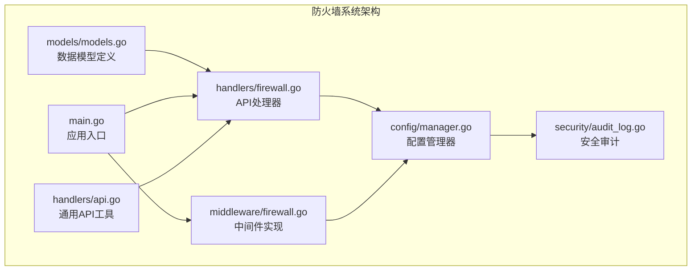
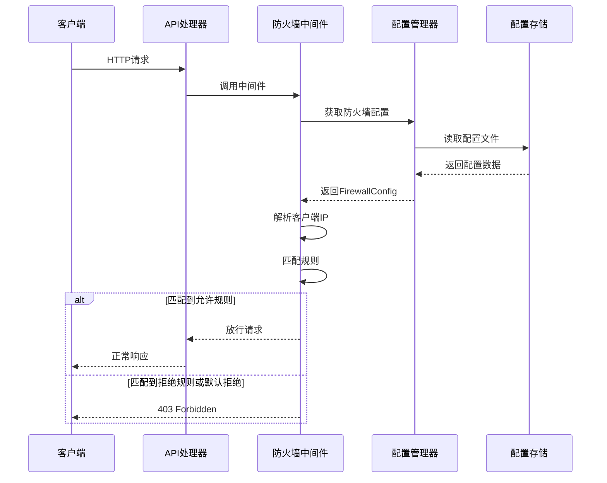
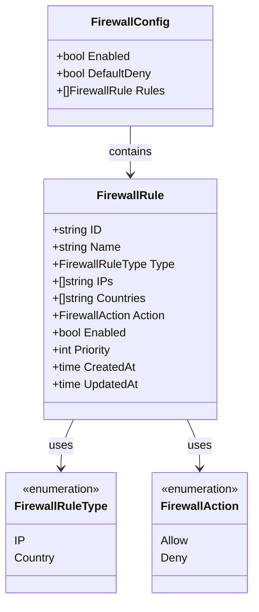
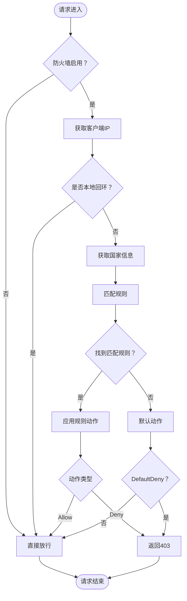
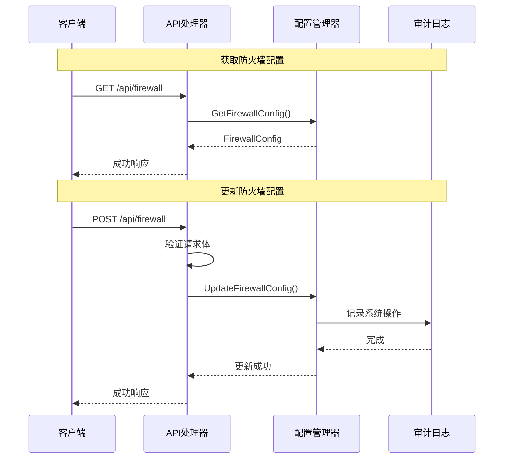
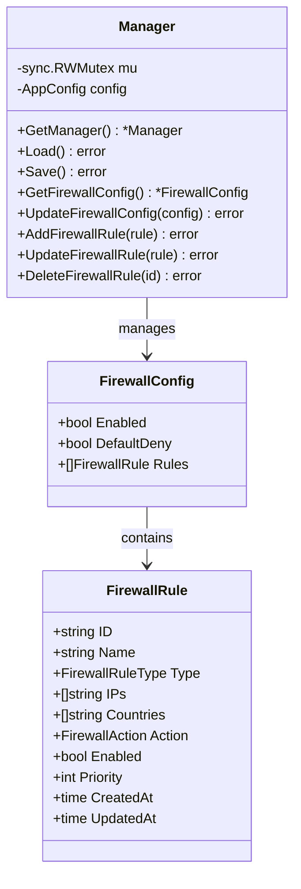
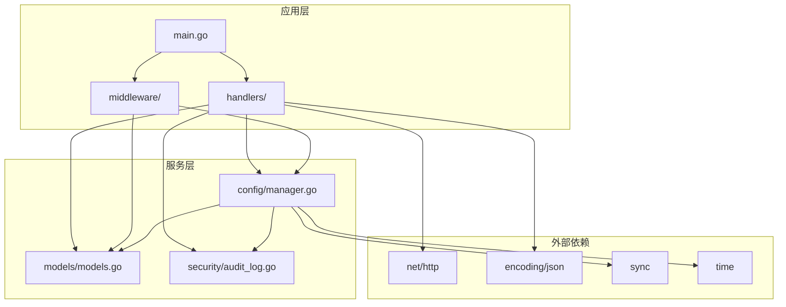

# 防火墙模型定义

<cite>
**本文档引用的文件**
- [src/models/models.go](file://src/models/models.go)
- [src/handlers/firewall.go](file://src/handlers/firewall.go)
- [src/middleware/firewall.go](file://src/middleware/firewall.go)
- [src/config/manager.go](file://src/config/manager.go)
- [src/main.go](file://src/main.go)
- [src/handlers/api.go](file://src/handlers/api.go)
- [src/security/audit_log.go](file://src/security/audit_log.go)
</cite>

## 目录
1. [简介](#简介)
2. [项目结构](#项目结构)
3. [核心组件](#核心组件)
4. [架构概览](#架构概览)
5. [详细组件分析](#详细组件分析)
6. [依赖关系分析](#依赖关系分析)
7. [性能考虑](#性能考虑)
8. [故障排除指南](#故障排除指南)
9. [结论](#结论)

## 简介

防火墙模块是 Caddy Panel 系统中的一个关键安全组件，提供了基于 IP 地址和地理位置的访问控制功能。该模块通过中间件的形式在请求处理流程中实施访问控制策略，支持动态配置和实时生效，为系统提供了灵活而强大的安全防护能力。

防火墙系统采用配置驱动的设计模式，通过 JSON 配置文件持久化规则，并提供完整的 API 接口用于动态管理和监控。系统还集成了安全审计功能，能够记录所有防火墙相关的操作和访问事件。

## 项目结构

防火墙相关的代码分布在以下主要文件中：



**图表来源**
- [src/models/models.go:346-393](file://src/models/models.go#L346-L393)
- [src/handlers/firewall.go:1-201](file://src/handlers/firewall.go#L1-L201)
- [src/middleware/firewall.go:1-241](file://src/middleware/firewall.go#L1-L241)

**章节来源**
- [src/models/models.go:1-393](file://src/models/models.go#L1-L393)
- [src/handlers/firewall.go:1-201](file://src/handlers/firewall.go#L1-L201)
- [src/middleware/firewall.go:1-241](file://src/middleware/firewall.go#L1-L241)

## 核心组件

防火墙系统由以下核心组件构成：

### 数据模型层
- **FirewallConfig**: 防火墙配置对象，包含启用状态、默认行为和规则列表
- **FirewallRule**: 单个防火墙规则，支持 IP 和国家两种匹配类型
- **FirewallRuleType**: 规则类型枚举（IP/IP段、国家）
- **FirewallAction**: 动作类型枚举（允许、拒绝）

### 处理器层
- **配置处理器**: 提供防火墙配置的获取和更新接口
- **规则处理器**: 支持规则的增删改查操作
- **通用工具**: 错误处理、响应格式化、请求上下文提取

### 中间件层
- **防火墙中间件**: 在请求处理链中实施访问控制
- **IP解析**: 支持多种代理头的客户端 IP 获取
- **规则匹配**: 实现复杂的匹配逻辑和优先级处理

**章节来源**
- [src/models/models.go:346-393](file://src/models/models.go#L346-L393)
- [src/handlers/firewall.go:21-201](file://src/handlers/firewall.go#L21-L201)
- [src/middleware/firewall.go:13-56](file://src/middleware/firewall.go#L13-L56)

## 架构概览

防火墙系统采用分层架构设计，各层职责清晰分离：



**图表来源**
- [src/main.go:421-427](file://src/main.go#L421-L427)
- [src/middleware/firewall.go:14-56](file://src/middleware/firewall.go#L14-L56)
- [src/config/manager.go:644-658](file://src/config/manager.go#L644-L658)

## 详细组件分析

### 数据模型设计

防火墙系统的核心数据模型采用简洁而强大的设计：



**图表来源**
- [src/models/models.go:346-393](file://src/models/models.go#L346-L393)

#### 配置模型特性
- **启用控制**: 通过 `Enabled` 字段控制整个防火墙功能的开关
- **默认行为**: `DefaultDeny` 决定未匹配规则时的默认处理策略
- **规则优先级**: 数字越小优先级越高，确保重要规则优先执行
- **时间追踪**: 自动记录创建和更新时间，便于审计和调试

#### 规则模型特性
- **多类型支持**: 同时支持 IP/IP段和国家两种匹配方式
- **灵活动作**: 支持允许和拒绝两种动作类型
- **状态管理**: `Enabled` 字段允许临时禁用特定规则
- **唯一标识**: 自动生成的规则 ID 确保规则的唯一性

**章节来源**
- [src/models/models.go:346-393](file://src/models/models.go#L346-L393)

### 中间件实现

防火墙中间件是系统的核心执行组件，负责在请求到达时进行实时访问控制：



**图表来源**
- [src/middleware/firewall.go:14-56](file://src/middleware/firewall.go#L14-L56)
- [src/middleware/firewall.go:154-189](file://src/middleware/firewall.go#L154-L189)

#### IP 解析机制
中间件实现了多层 IP 解析策略：
1. **X-Forwarded-For**: 优先从代理头获取真实客户端 IP
2. **X-Real-IP**: 作为备选方案获取客户端 IP
3. **RemoteAddr**: 最后的兜底方案

#### 规则匹配算法
规则匹配采用严格的优先级和精确度原则：
1. **优先级排序**: 按照 `Priority` 字段升序排列
2. **类型匹配**: 优先匹配 IP 规则，然后匹配国家规则
3. **精确度匹配**: CIDR 格式比对更精确，单个 IP 作为后备

**章节来源**
- [src/middleware/firewall.go:58-241](file://src/middleware/firewall.go#L58-L241)

### API 处理器

防火墙 API 处理器提供了完整的 RESTful 接口：



**图表来源**
- [src/handlers/firewall.go:21-68](file://src/handlers/firewall.go#L21-L68)
- [src/handlers/firewall.go:70-119](file://src/handlers/firewall.go#L70-L119)

#### 请求处理流程
每个 API 端点都遵循统一的处理模式：
1. **方法验证**: 确保 HTTP 方法正确
2. **请求体解析**: 验证和解析 JSON 数据
3. **业务逻辑执行**: 调用配置管理器执行相应操作
4. **审计记录**: 记录所有重要的系统操作
5. **响应格式化**: 统一的 JSON 响应格式

**章节来源**
- [src/handlers/firewall.go:1-201](file://src/handlers/firewall.go#L1-L201)
- [src/handlers/api.go:102-127](file://src/handlers/api.go#L102-L127)

### 配置管理

配置管理系统提供了线程安全的数据持久化能力：



**图表来源**
- [src/config/manager.go:18-77](file://src/config/manager.go#L18-L77)
- [src/config/manager.go:644-738](file://src/config/manager.go#L644-L738)

#### 线程安全设计
- **读写锁**: 使用 `sync.RWMutex` 确保并发安全
- **深拷贝**: 返回配置时进行深拷贝，防止外部修改
- **原子操作**: 所有配置更新都是原子性的

#### 数据持久化
- **JSON 序列化**: 使用标准库进行配置序列化
- **自动保存**: 所有配置变更都会自动保存到文件
- **默认值处理**: 确保配置的完整性和一致性

**章节来源**
- [src/config/manager.go:18-112](file://src/config/manager.go#L18-L112)
- [src/config/manager.go:644-738](file://src/config/manager.go#L644-L738)

## 依赖关系分析

防火墙系统的依赖关系清晰且层次分明：



**图表来源**
- [src/main.go:16-22](file://src/main.go#L16-L22)
- [src/handlers/firewall.go:3-14](file://src/handlers/firewall.go#L3-L14)
- [src/middleware/firewall.go:3-11](file://src/middleware/firewall.go#L3-L11)

### 关键依赖关系
1. **处理器依赖配置管理器**: 所有防火墙操作都需要通过配置管理器
2. **中间件依赖配置管理器**: 实时获取最新的防火墙配置
3. **审计日志依赖配置**: 从配置中获取日志存储限制
4. **应用入口依赖处理器**: 将防火墙中间件集成到请求处理链

**章节来源**
- [src/main.go:421-427](file://src/main.go#L421-L427)
- [src/handlers/firewall.go:28-54](file://src/handlers/firewall.go#L28-L54)
- [src/middleware/firewall.go:17-18](file://src/middleware/firewall.go#L17-L18)

## 性能考虑

防火墙系统在设计时充分考虑了性能优化：

### 内存优化
- **零拷贝策略**: 使用切片复制而非深层克隆
- **延迟初始化**: 配置在首次访问时才加载
- **缓存机制**: 中间件缓存最近的配置状态

### 计算优化
- **早期退出**: 匹配到规则立即返回结果
- **优先级预排序**: 规则按优先级预先排序
- **短路评估**: IP 匹配使用短路逻辑

### 并发优化
- **读写分离**: 读操作使用读锁，写操作使用写锁
- **无阻塞设计**: 避免长时间持有锁
- **批量操作**: 支持批量规则操作

## 故障排除指南

### 常见问题诊断

#### 防火墙不生效
1. **检查启用状态**: 确认 `Enabled` 字段为 `true`
2. **验证规则配置**: 检查规则是否正确配置
3. **查看日志**: 检查系统日志中的防火墙相关记录

#### 规则匹配异常
1. **IP 格式验证**: 确认 IP 地址使用正确的 CIDR 格式
2. **优先级检查**: 验证规则优先级设置
3. **代理头配置**: 确认代理服务器正确设置转发头

#### 性能问题
1. **规则数量**: 大量规则可能影响匹配性能
2. **匹配复杂度**: 复杂的 CIDR 范围影响匹配速度
3. **并发访问**: 高并发场景下的锁竞争

**章节来源**
- [src/middleware/firewall.go:154-189](file://src/middleware/firewall.go#L154-L189)
- [src/config/manager.go:644-658](file://src/config/manager.go#L644-L658)

### 调试技巧

#### 开启详细日志
```bash
# 设置日志级别为 debug
./caddy-panel -log_level debug
```

#### 测试规则配置
```bash
# 测试防火墙配置
curl -X GET http://localhost:8080/api/firewall
```

#### 监控规则效果
```bash
# 查看安全日志
curl -X GET http://localhost:8080/api/security-logs
```

## 结论

防火墙模块展现了优秀的软件工程实践，具有以下特点：

### 设计优势
- **模块化设计**: 清晰的分层架构，职责分离明确
- **扩展性强**: 支持新的规则类型和匹配条件
- **易用性**: 提供完整的 API 接口和配置选项
- **安全性**: 集成审计日志，支持合规要求

### 技术亮点
- **高性能**: 优化的匹配算法和内存使用
- **可靠性**: 线程安全的配置管理和持久化
- **可观测性**: 完善的日志记录和监控支持
- **兼容性**: 支持多种代理环境和网络拓扑

### 发展方向
1. **地理信息集成**: 完善 GeoIP 功能
2. **规则引擎增强**: 支持更复杂的匹配条件
3. **性能优化**: 进一步提升大规模场景下的性能
4. **可视化界面**: 提供图形化的防火墙管理界面

防火墙系统为 Caddy Panel 提供了坚实的安全基础，其设计和实现体现了现代 Web 应用安全的最佳实践。