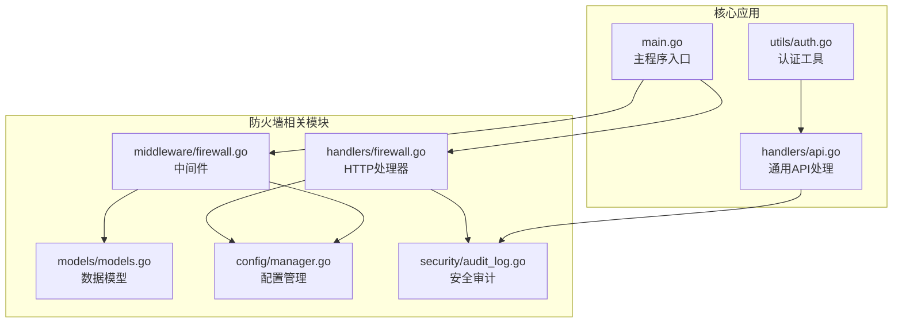
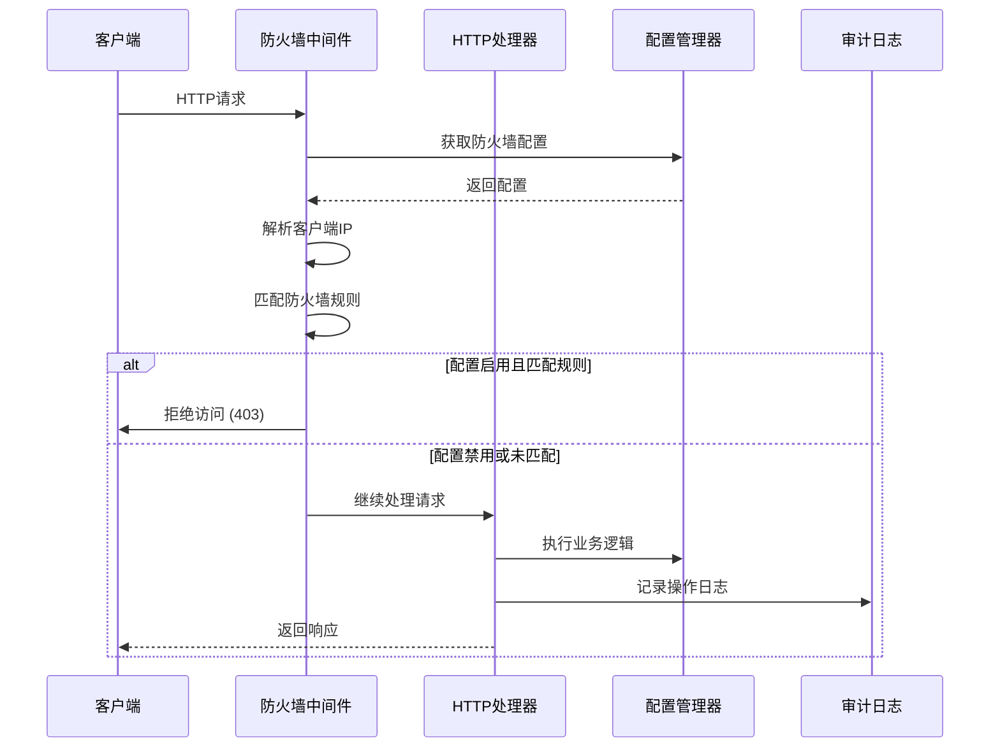
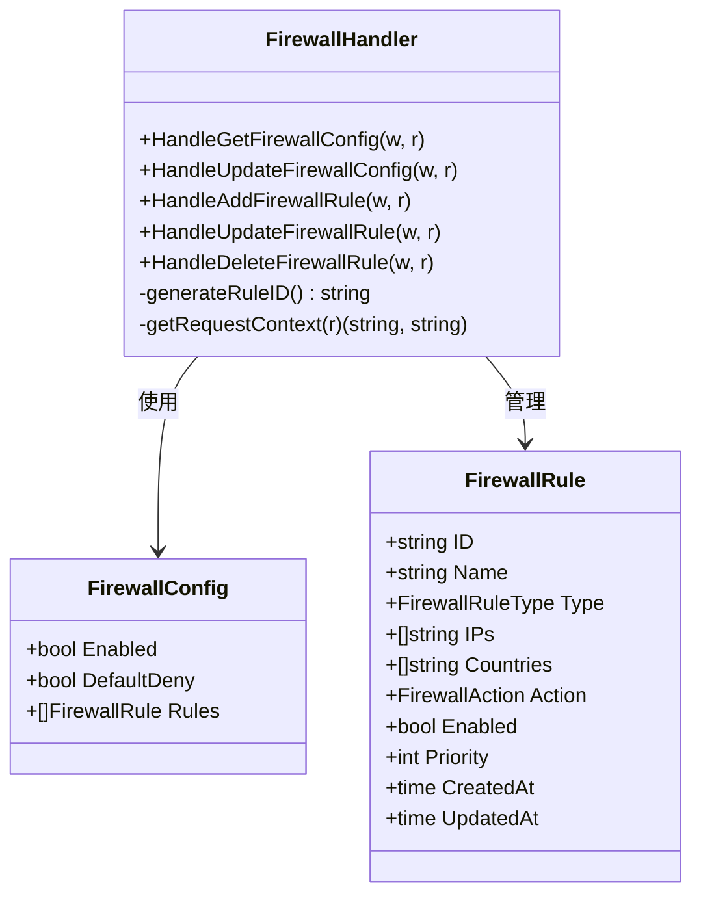
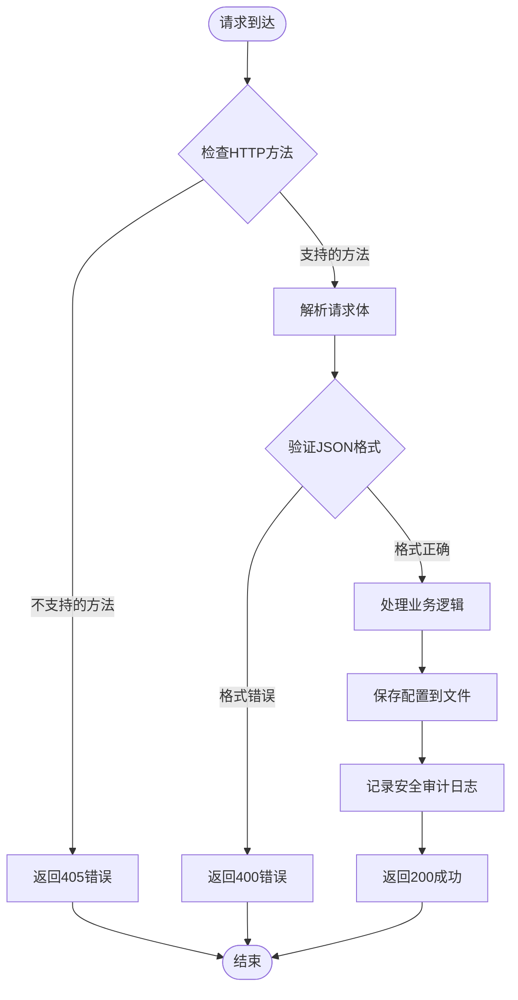
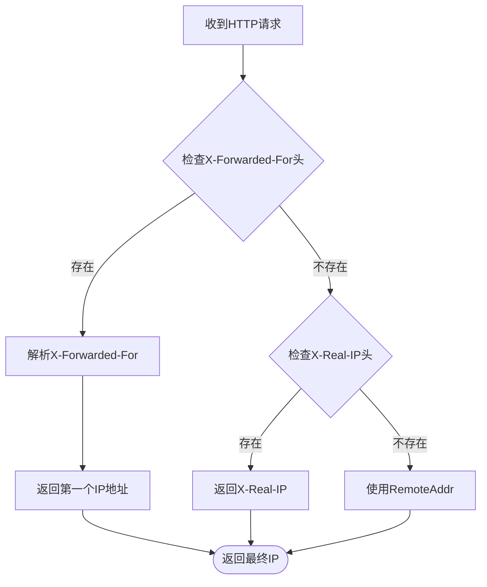
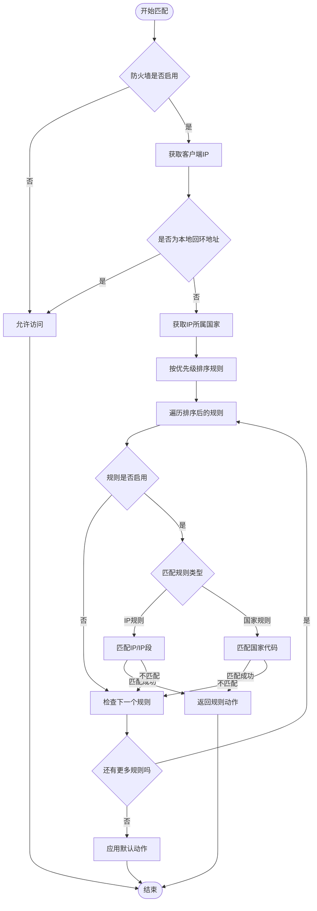
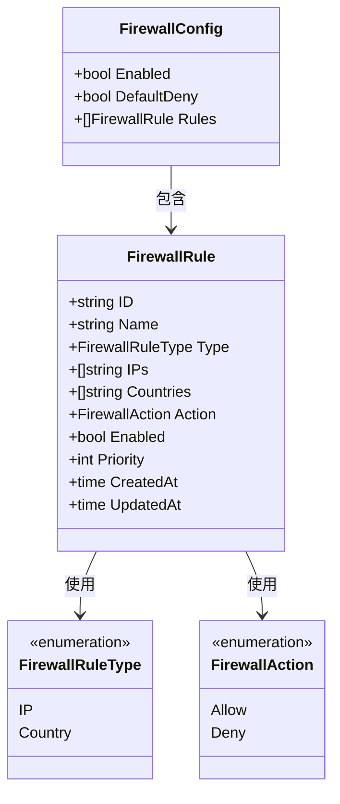
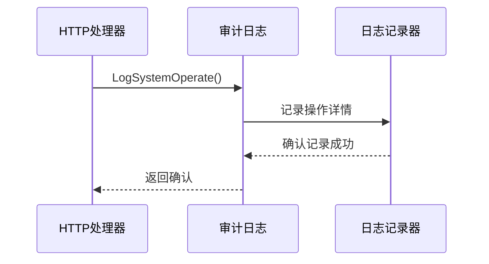
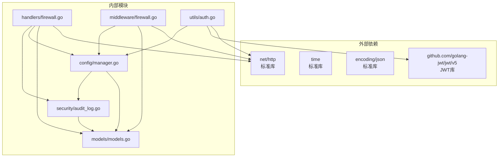

# 防火墙处理器

<cite>
**本文档引用的文件**
- [firewall.go](file://src/handlers/firewall.go)
- [firewall.go](file://src/middleware/firewall.go)
- [models.go](file://src/models/models.go)
- [manager.go](file://src/config/manager.go)
- [audit_log.go](file://src/security/audit_log.go)
- [main.go](file://src/main.go)
- [api.go](file://src/handlers/api.go)
- [auth.go](file://src/utils/auth.go)
</cite>

## 目录
1. [简介](#简介)
2. [项目结构](#项目结构)
3. [核心组件](#核心组件)
4. [架构概览](#架构概览)
5. [详细组件分析](#详细组件分析)
6. [依赖关系分析](#依赖关系分析)
7. [性能考虑](#性能考虑)
8. [故障排除指南](#故障排除指南)
9. [结论](#结论)

## 简介

防火墙处理器是 Caddy Panel 项目中的一个关键安全组件，负责实现基于 IP 地址和地理位置的访问控制功能。该系统提供了完整的防火墙配置管理、规则匹配和访问控制机制，能够有效保护管理后台免受恶意访问。

系统采用中间件模式，在请求进入 API 服务之前进行访问控制检查，支持灵活的规则配置和实时生效。防火墙功能包括 IP 白名单/黑名单、国家地理限制、优先级排序等功能特性。

## 项目结构

防火墙处理器在项目中的组织结构如下：

**图表来源**
- [firewall.go:1-201](file://src/handlers/firewall.go#L1-L201)
- [firewall.go:1-241](file://src/middleware/firewall.go#L1-L241)
- [models.go:346-393](file://src/models/models.go#L346-L393)

**章节来源**
- [firewall.go:1-201](file://src/handlers/firewall.go#L1-L201)
- [firewall.go:1-241](file://src/middleware/firewall.go#L1-L241)
- [models.go:346-393](file://src/models/models.go#L346-L393)

## 核心组件

防火墙处理器由四个主要组件构成：

### 1. HTTP 处理器层
- **配置管理接口**：提供防火墙配置的获取和更新功能
- **规则管理接口**：支持防火墙规则的增删改查操作
- **安全审计集成**：所有操作都会记录到安全审计日志中

### 2. 中间件层
- **访问控制中间件**：在请求到达具体处理器之前进行访问控制
- **IP 解析**：支持多种代理头的 IP 提取
- **规则匹配引擎**：实现复杂的规则匹配逻辑

### 3. 数据模型层
- **防火墙配置**：包含启用状态、默认策略和规则列表
- **防火墙规则**：支持 IP/IP 段和国家两种规则类型
- **规则动作**：允许和拒绝两种操作结果

### 4. 配置管理层
- **持久化存储**：将防火墙配置保存到应用程序配置文件中
- **实时更新**：支持配置的动态修改和即时生效

**章节来源**
- [firewall.go:21-201](file://src/handlers/firewall.go#L21-L201)
- [firewall.go:13-56](file://src/middleware/firewall.go#L13-L56)
- [models.go:346-393](file://src/models/models.go#L346-L393)
- [manager.go:644-738](file://src/config/manager.go#L644-L738)

## 架构概览

防火墙处理器采用分层架构设计，确保了良好的模块化和可维护性：

**图表来源**
- [firewall.go:14-56](file://src/middleware/firewall.go#L14-L56)
- [firewall.go:21-68](file://src/handlers/firewall.go#L21-L68)
- [audit_log.go:149-166](file://src/security/audit_log.go#L149-L166)

系统架构的关键特点：

1. **中间件优先**：防火墙检查在所有业务逻辑之前执行
2. **配置驱动**：所有行为都由配置文件控制
3. **审计完整**：所有操作都有详细的安全审计记录
4. **实时生效**：配置修改后立即影响后续请求

## 详细组件分析

### HTTP 处理器组件

HTTP 处理器提供了完整的防火墙管理 API 接口：

#### 配置管理接口
- **GET /api/firewall**：获取当前防火墙配置
- **POST /api/firewall**：更新防火墙配置

#### 规则管理接口
- **GET /api/firewall/rules**：获取所有防火墙规则
- **POST /api/firewall/rules**：添加新的防火墙规则
- **PUT /api/firewall/rules/{id}**：更新指定防火墙规则
- **DELETE /api/firewall/rules/{id}**：删除指定防火墙规则

**图表来源**
- [firewall.go:16-201](file://src/handlers/firewall.go#L16-L201)
- [models.go:376-393](file://src/models/models.go#L376-L393)

#### 请求处理流程

每个 HTTP 处理器都遵循相同的处理模式：

**图表来源**
- [firewall.go:34-68](file://src/handlers/firewall.go#L34-L68)
- [firewall.go:70-119](file://src/handlers/firewall.go#L70-L119)

**章节来源**
- [firewall.go:21-201](file://src/handlers/firewall.go#L21-L201)

### 中间件组件

防火墙中间件是整个系统的核心控制点：

#### IP 地址解析机制
中间件实现了多层 IP 地址解析，确保能够准确获取真实的客户端 IP：

**图表来源**
- [firewall.go:58-82](file://src/middleware/firewall.go#L58-L82)

#### 规则匹配算法
中间件采用优先级排序和短路求值的策略：

**图表来源**
- [firewall.go:153-189](file://src/middleware/firewall.go#L153-L189)

**章节来源**
- [firewall.go:13-241](file://src/middleware/firewall.go#L13-L241)

### 数据模型组件

防火墙系统使用了清晰的数据模型设计：

#### 防火墙配置模型

**图表来源**
- [models.go:346-393](file://src/models/models.go#L346-L393)

#### 配置持久化机制
配置管理器提供了完整的 CRUD 操作：

**章节来源**
- [models.go:346-393](file://src/models/models.go#L346-L393)
- [manager.go:644-738](file://src/config/manager.go#L644-L738)

### 安全审计组件

所有防火墙操作都会被记录到安全审计日志中：

#### 审计日志记录
- **配置变更**：启用/禁用防火墙
- **规则操作**：新增、更新、删除规则
- **访问控制**：拒绝访问的尝试

**图表来源**
- [audit_log.go:149-166](file://src/security/audit_log.go#L149-L166)

**章节来源**
- [audit_log.go:149-166](file://src/security/audit_log.go#L149-L166)

## 依赖关系分析

防火墙处理器的依赖关系图：

**图表来源**
- [firewall.go:3-14](file://src/handlers/firewall.go#L3-L14)
- [firewall.go:3-11](file://src/middleware/firewall.go#L3-L11)

### 关键依赖特性

1. **最小化外部依赖**：只使用标准库和必要的第三方库
2. **模块化设计**：各组件职责明确，耦合度低
3. **类型安全**：使用 Go 的强类型系统确保数据完整性
4. **并发安全**：配置管理器使用读写锁保证线程安全

**章节来源**
- [firewall.go:3-14](file://src/handlers/firewall.go#L3-L14)
- [firewall.go:3-11](file://src/middleware/firewall.go#L3-L11)

## 性能考虑

防火墙处理器在设计时充分考虑了性能因素：

### 时间复杂度优化
- **规则匹配**：O(n) 线性扫描，其中 n 为规则数量
- **IP 匹配**：O(1) 常数时间，使用 CIDR 包含检查
- **内存使用**：配置缓存在内存中，避免频繁磁盘 I/O

### 性能优化策略
1. **规则排序**：按优先级排序，高优先级规则先匹配
2. **短路求值**：一旦匹配到规则立即返回
3. **缓存机制**：配置读取使用内存缓存
4. **并发控制**：使用读写锁平衡并发访问

### 可扩展性设计
- **规则类型扩展**：支持未来添加新的规则类型
- **匹配算法优化**：可替换更高效的匹配算法
- **配置存储扩展**：支持多种配置存储后端

## 故障排除指南

### 常见问题及解决方案

#### 1. 防火墙规则不生效
**可能原因**：
- 防火墙配置未启用
- 规则优先级设置不当
- IP 地址解析错误

**解决步骤**：
1. 检查防火墙配置状态
2. 验证规则优先级设置
3. 查看访问日志确认 IP 解析

#### 2. 访问被意外拒绝
**可能原因**：
- 本地回环地址未正确识别
- 代理配置导致 IP 地址错误
- 默认拒绝策略启用

**解决步骤**：
1. 检查代理头配置
2. 验证本地地址白名单
3. 调整默认策略设置

#### 3. 安全审计日志缺失
**可能原因**：
- 审计日志存储初始化失败
- 配置文件权限问题
- 磁盘空间不足

**解决步骤**：
1. 检查审计日志存储路径
2. 验证文件权限设置
3. 清理过期日志文件

**章节来源**
- [firewall.go:114-151](file://src/middleware/firewall.go#L114-L151)
- [audit_log.go:33-44](file://src/security/audit_log.go#L33-L44)

## 结论

防火墙处理器是一个设计精良的安全组件，具有以下突出特点：

### 技术优势
1. **架构清晰**：分层设计确保了良好的可维护性
2. **功能完整**：提供了从配置到审计的完整解决方案
3. **性能优秀**：优化的算法和数据结构保证了高效运行
4. **扩展性强**：模块化设计支持未来的功能扩展

### 安全特性
1. **实时生效**：配置修改后立即影响所有后续请求
2. **全面审计**：所有操作都有详细的安全日志记录
3. **多重防护**：支持 IP 白名单、国家限制等多种防护策略
4. **透明控制**：提供完整的访问控制和监控能力

### 实用价值
防火墙处理器不仅满足了基本的访问控制需求，还为系统提供了强大的安全监控和审计能力。其简洁的设计和完善的实现使其成为 Caddy Panel 项目中不可或缺的重要组成部分。

通过合理的配置和使用，管理员可以有效地保护系统免受恶意访问，同时保持系统的可用性和性能。