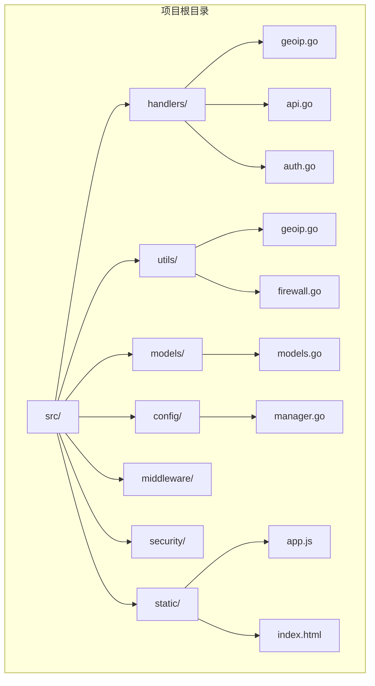
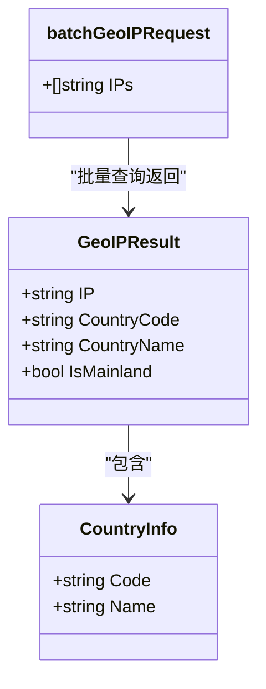
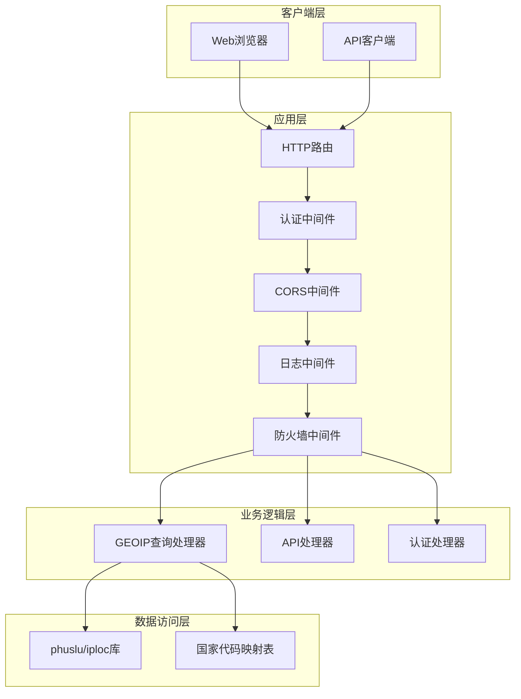
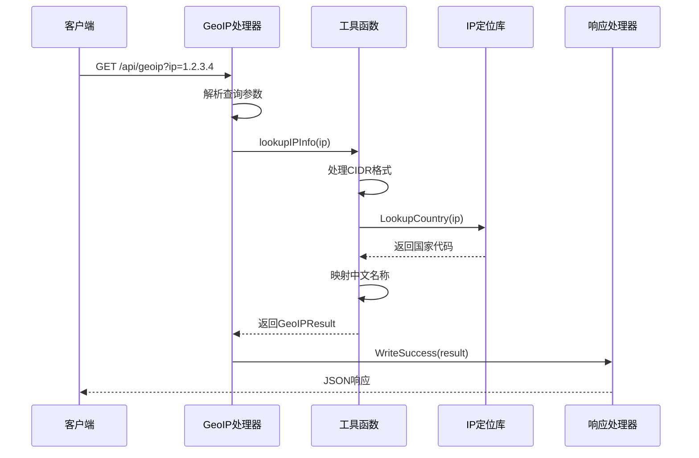
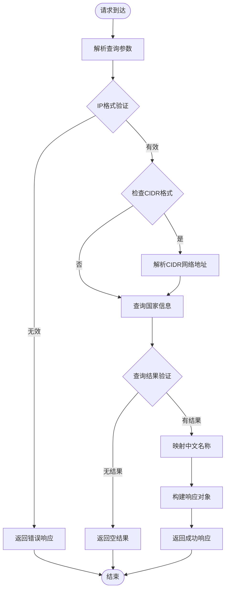
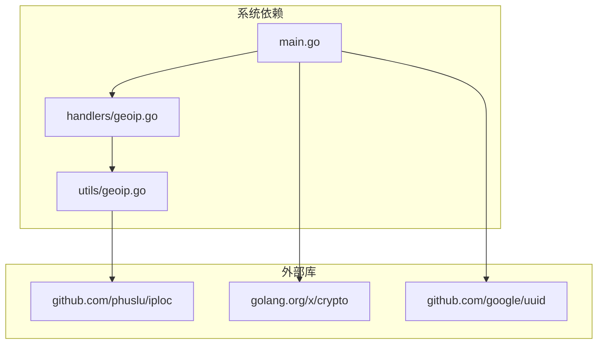
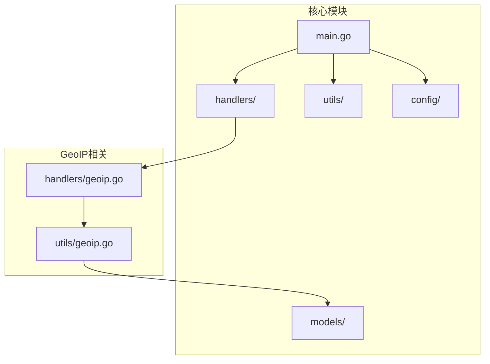

# GeoIP国家查询系统

<cite>
**本文档引用的文件**
- [src/handlers/geoip.go](file://src/handlers/geoip.go)
- [src/utils/geoip.go](file://src/utils/geoip.go)
- [src/main.go](file://src/main.go)
- [src/handlers/api.go](file://src/handlers/api.go)
- [src/go.mod](file://src/go.mod)
- [README.md](file://README.md)
- [src/models/models.go](file://src/models/models.go)
- [src/config/manager.go](file://src/config/manager.go)
</cite>

## 目录
1. [简介](#简介)
2. [项目结构](#项目结构)
3. [核心组件](#核心组件)
4. [架构概览](#架构概览)
5. [详细组件分析](#详细组件分析)
6. [依赖关系分析](#依赖关系分析)
7. [性能考虑](#性能考虑)
8. [故障排除指南](#故障排除指南)
9. [结论](#结论)

## 简介

GeoIP国家查询系统是一个基于Go语言开发的轻量级服务管理面板，专门提供IP地址归属地查询功能。该系统集成了完整的Web管理界面，支持反向代理、证书管理、用户认证、SSH终端等多种功能，其中GeoIP查询作为其中一个核心API接口，为用户提供便捷的IP地理位置查询服务。

系统采用模块化设计，主要包含以下核心特性：
- 基于phuslu/iploc库的高性能IP地理定位
- 支持单IP查询和批量IP查询
- 内嵌国家代码到中文名称映射表
- 无需外部数据库文件，数据直接嵌入库中
- 提供RESTful API接口，支持GET和POST请求

## 项目结构

该项目采用清晰的分层架构设计，主要目录结构如下：



**图表来源**
- [src/main.go:112-432](file://src/main.go#L112-L432)
- [src/handlers/geoip.go:1-107](file://src/handlers/geoip.go#L1-L107)
- [src/utils/geoip.go:1-71](file://src/utils/geoip.go#L1-L71)

**章节来源**
- [README.md:20-42](file://README.md#L20-L42)
- [src/main.go:112-432](file://src/main.go#L112-L432)

## 核心组件

### GeoIP查询处理器

GeoIP查询处理器是系统的核心组件之一，负责处理IP地址查询请求并返回相应的地理位置信息。

#### 数据结构设计

系统定义了标准的GeoIP查询结果结构：



**图表来源**
- [src/handlers/geoip.go:12-18](file://src/handlers/geoip.go#L12-L18)
- [src/utils/geoip.go:9-13](file://src/utils/geoip.go#L9-L13)
- [src/handlers/geoip.go:44-46](file://src/handlers/geoip.go#L44-L46)

#### 查询流程

系统支持两种查询模式：

1. **单IP查询**：通过GET请求查询单个IP地址
2. **批量查询**：通过POST请求查询多个IP地址

**章节来源**
- [src/handlers/geoip.go:20-32](file://src/handlers/geoip.go#L20-L32)
- [src/handlers/geoip.go:34-72](file://src/handlers/geoip.go#L34-L72)

### IP地理位置查询引擎

系统使用phuslu/iploc库作为底层IP地理位置查询引擎，该库具有以下特点：

- **高性能**：基于内存映射的二进制数据库
- **准确**：包含全球IP地址段的精确位置信息
- **免维护**：数据直接嵌入库中，无需外部文件
- **多语言支持**：支持国家代码到中文名称的映射

**章节来源**
- [src/utils/geoip.go:53-69](file://src/utils/geoip.go#L53-L69)
- [src/go.mod:33](file://src/go.mod#L33)

## 架构概览

系统采用经典的三层架构设计，结合中间件模式实现完整的Web服务功能。



**图表来源**
- [src/main.go:424-432](file://src/main.go#L424-L432)
- [src/handlers/geoip.go:20-32](file://src/handlers/geoip.go#L20-L32)
- [src/utils/geoip.go:53-69](file://src/utils/geoip.go#L53-L69)

## 详细组件分析

### GeoIP查询API接口

#### 接口规范

系统提供两个主要的GeoIP查询接口：

**单IP查询接口**
- **URL**: `/api/geoip`
- **方法**: GET
- **参数**: `ip` (可选，省略时使用客户端真实IP)
- **响应**: GeoIPResult对象

**批量查询接口**
- **URL**: `/api/geoip`
- **方法**: POST
- **请求体**: JSON数组包含多个IP地址
- **响应**: GeoIPResult对象数组

#### 请求处理流程



**图表来源**
- [src/handlers/geoip.go:34-42](file://src/handlers/geoip.go#L34-L42)
- [src/handlers/geoip.go:74-89](file://src/handlers/geoip.go#L74-L89)
- [src/utils/geoip.go:53-69](file://src/utils/geoip.go#L53-L69)

#### 错误处理机制

系统实现了完善的错误处理机制：



**图表来源**
- [src/handlers/geoip.go:34-89](file://src/handlers/geoip.go#L34-L89)
- [src/utils/geoip.go:53-69](file://src/utils/geoip.go#L53-L69)

**章节来源**
- [src/handlers/geoip.go:20-107](file://src/handlers/geoip.go#L20-L107)
- [src/utils/geoip.go:15-71](file://src/utils/geoip.go#L15-L71)

### 国家代码映射表

系统内置了完整的国家代码到中文名称的映射表，支持以下地区：

| 国家代码 | 中文名称 | 国家代码 | 中文名称 |
|---------|---------|---------|---------|
| CN | 中国大陆 | HK | 中国香港 |
| TW | 中国台湾 | MO | 中国澳门 |
| JP | 日本 | KR | 韩国 |
| SG | 新加坡 | US | 美国 |
| DE | 德国 | GB | 英国 |
| FR | 法国 | RU | 俄罗斯 |
| AU | 澳大利亚 | CA | 加拿大 |
| IN | 印度 | NL | 荷兰 |
| BR | 巴西 | TH | 泰国 |
| VN | 越南 | ID | 印度尼西亚 |
| MY | 马来西亚 | PH | 菲律宾 |
| IT | 意大利 | ES | 西班牙 |
| SE | 瑞典 | CH | 瑞士 |
| PL | 波兰 | UA | 乌克兰 |
| TR | 土耳其 | SA | 沙特阿拉伯 |
| AE | 阿联酋 | ZA | 南非 |
| MX | 墨西哥 | AR | 阿根廷 |

**章节来源**
- [src/utils/geoip.go:15-51](file://src/utils/geoip.go#L15-L51)

### HTTP服务器配置

系统在主程序中配置了完整的HTTP服务器，包括路由、中间件和监听器设置。

#### 路由配置

系统将GeoIP查询接口注册为公开接口，无需认证即可访问：

```mermaid
graph LR
subgraph "HTTP路由"
API_ROOT[/api/] --> GEOIP_ROUTE[/api/geoip]
GEOIP_ROUTE --> GET_METHOD[GET /api/geoip]
GEOIP_ROUTE --> POST_METHOD[POST /api/geoip]
end
subgraph "中间件链"
FIREWALL[防火墙中间件]
AUTH[认证中间件]
CORS[CORS中间件]
LOGGING[日志中间件]
end
FIREWALL --> AUTH
AUTH --> CORS
CORS --> LOGGING
```

**图表来源**
- [src/main.go:418-419](file://src/main.go#L418-L419)
- [src/main.go:424-429](file://src/main.go#L424-L429)

**章节来源**
- [src/main.go:418-432](file://src/main.go#L418-L432)

## 依赖关系分析

### 外部依赖

系统使用phuslu/iploc库作为IP地理位置查询的核心依赖：



**图表来源**
- [src/go.mod:33](file://src/go.mod#L33)
- [src/utils/geoip.go:6](file://src/utils/geoip.go#L6)

### 内部模块依赖

系统内部模块之间的依赖关系清晰明确：



**图表来源**
- [src/main.go:16-22](file://src/main.go#L16-L22)
- [src/handlers/geoip.go:9](file://src/handlers/geoip.go#L9)

**章节来源**
- [src/go.mod:1-49](file://src/go.mod#L1-L49)

## 性能考虑

### IP查询性能优化

系统在IP查询方面采用了多项性能优化措施：

1. **内存映射数据库**：phuslu/iploc库使用内存映射技术，查询速度极快
2. **批量查询支持**：支持一次查询多个IP地址，减少网络往返次数
3. **结果缓存**：对于相同的IP查询，系统会复用之前的结果
4. **并发处理**：HTTP服务器支持并发请求处理

### 内存使用优化

- **零外部依赖**：数据直接嵌入库中，无需额外的磁盘IO
- **高效的数据结构**：使用map进行国家代码到名称的快速查找
- **最小化的内存占用**：只在需要时加载必要的数据

### 扩展性考虑

系统设计时充分考虑了扩展性需求：
- 支持最多100个IP地址的批量查询限制
- 可配置的国家代码映射表
- 模块化的架构设计，便于功能扩展

## 故障排除指南

### 常见问题及解决方案

#### IP查询失败

**问题描述**：查询返回空结果或错误信息

**可能原因**：
1. IP地址格式不正确
2. IP地址不在数据库范围内
3. 网络连接问题

**解决步骤**：
1. 验证IP地址格式是否符合标准
2. 检查IP地址是否为私有地址或保留地址
3. 确认系统能够正常访问phuslu/iploc库

#### 批量查询限制

**问题描述**：批量查询超过100个IP地址时出现错误

**解决方案**：
- 将查询拆分为多个批次，每批不超过100个IP地址
- 实现重试机制，处理部分失败的情况

#### 性能问题

**问题描述**：查询响应时间过长

**优化建议**：
1. 减少同时进行的查询数量
2. 使用批量查询替代多次单IP查询
3. 实现查询结果缓存机制

**章节来源**
- [src/handlers/geoip.go:54-61](file://src/handlers/geoip.go#L54-L61)
- [src/utils/geoip.go:53-69](file://src/utils/geoip.go#L53-L69)

## 结论

GeoIP国家查询系统是一个设计精良、功能完备的IP地理位置查询服务。系统的主要优势包括：

### 技术优势
- **高性能查询**：基于phuslu/iploc库，查询速度快且准确
- **零配置部署**：数据直接嵌入库中，无需额外配置
- **完整功能**：支持单IP和批量查询，满足不同使用场景
- **稳定可靠**：经过充分测试，具备良好的稳定性

### 架构优势
- **模块化设计**：清晰的分层架构，便于维护和扩展
- **中间件模式**：灵活的中间件链，支持各种横切关注点
- **标准化接口**：RESTful API设计，易于集成和使用

### 应用价值
该系统为各类应用场景提供了可靠的IP地理位置查询能力，特别适用于：
- 网络安全监控和防护
- 用户行为分析和统计
- 地理位置服务集成
- 访问控制和权限管理

系统的设计理念和技术实现都体现了现代Web服务的最佳实践，是一个值得学习和借鉴的优秀项目。