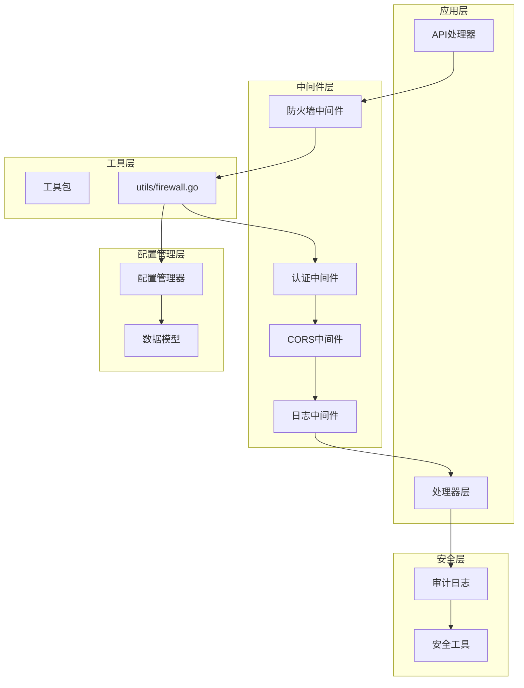
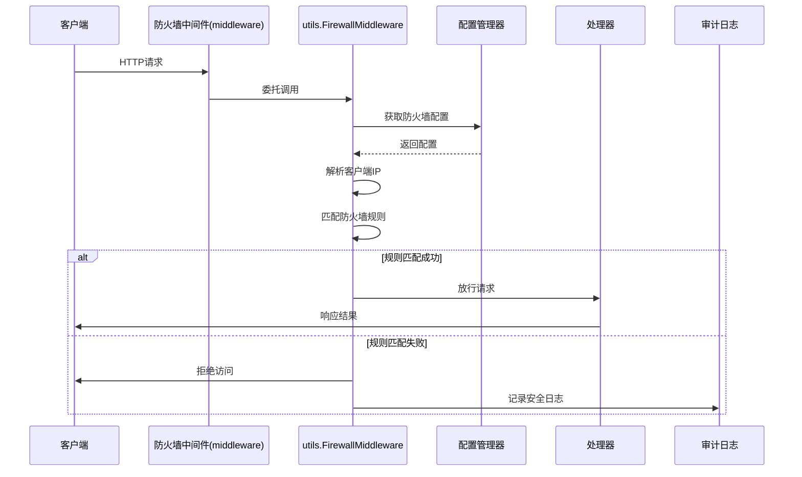
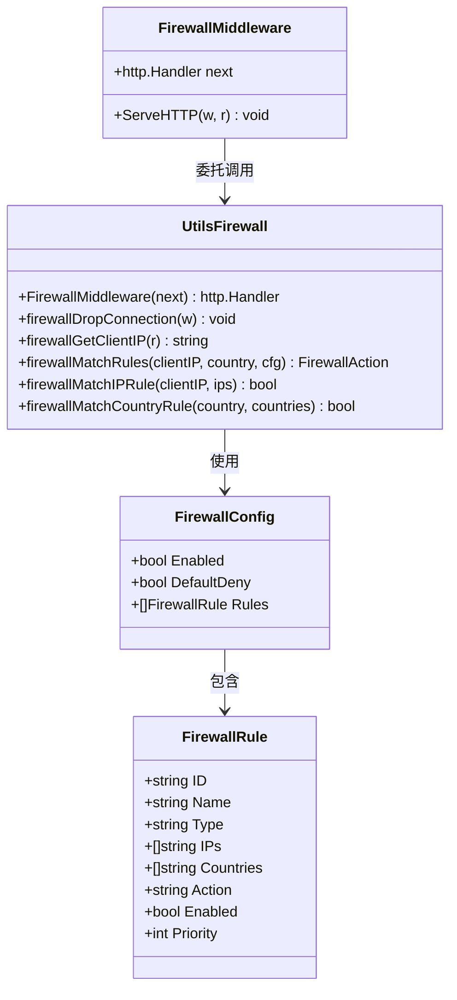
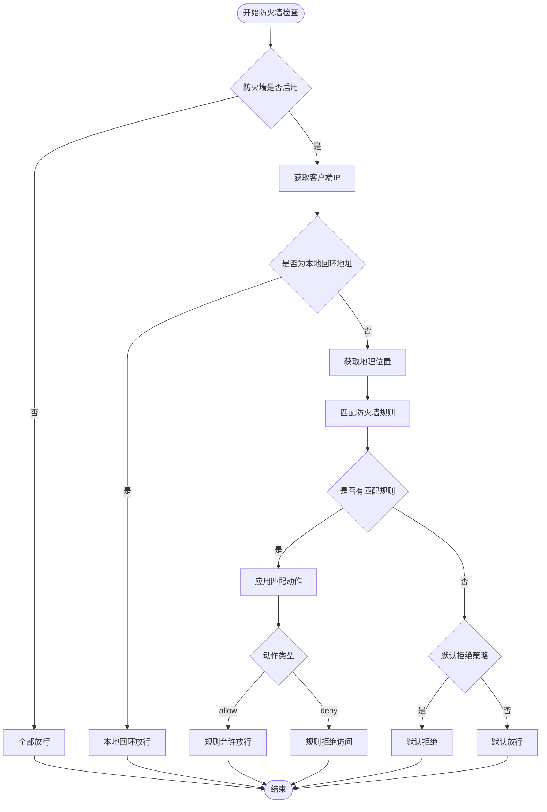
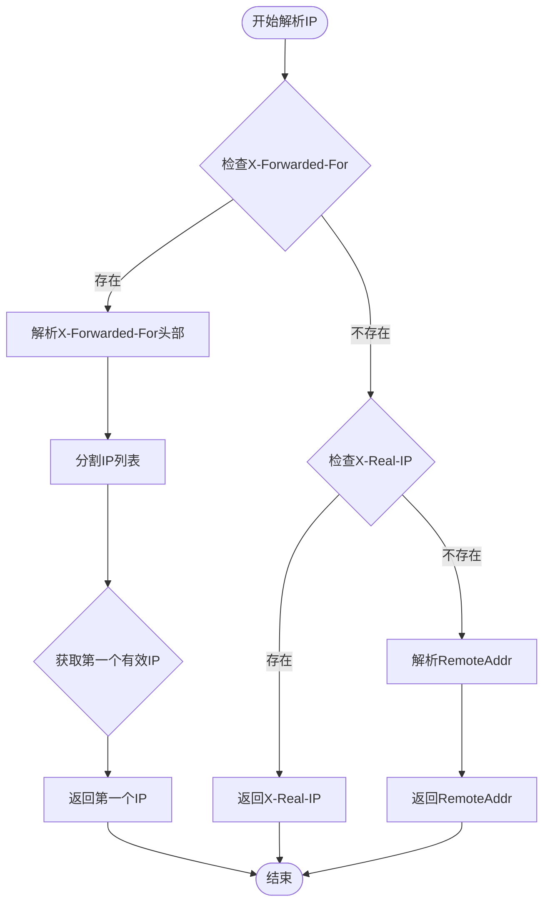
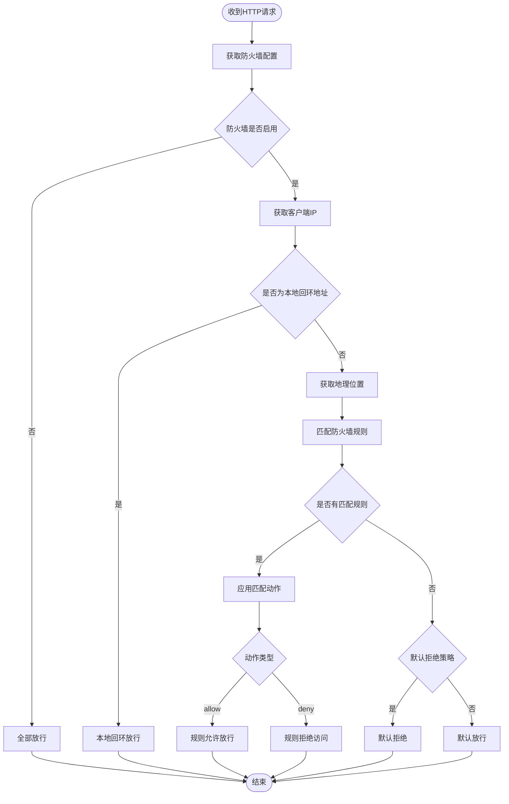
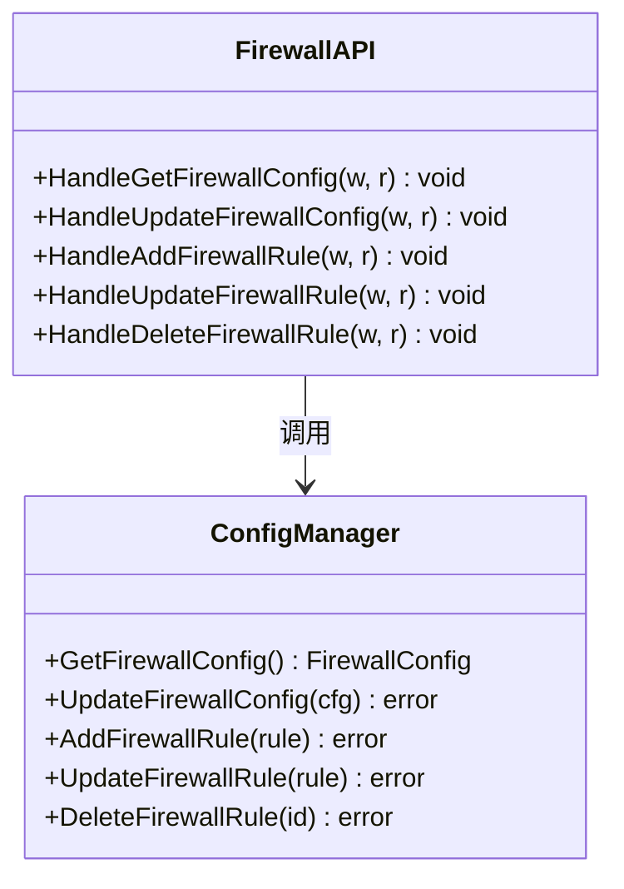
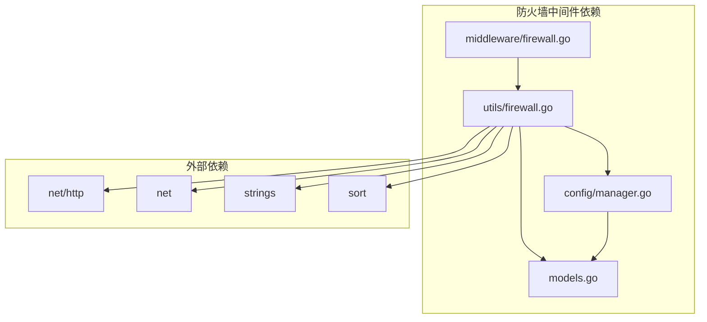

# 防火墙中间件

<cite>
**本文档引用的文件**
- [middleware/firewall.go](file://src/middleware/firewall.go)
- [utils/firewall.go](file://src/utils/firewall.go)
- [handlers/firewall.go](file://src/handlers/firewall.go)
- [models/models.go](file://src/models/models.go)
- [main.go](file://src/main.go)
- [config/manager.go](file://src/config/manager.go)
- [security/audit_log.go](file://src/security/audit_log.go)
</cite>

## 更新摘要
**变更内容**
- 更新防火墙中间件架构：从独立实现改为委托模式
- 新增 utils/firewall.go 作为核心逻辑实现
- 简化 middleware/firewall.go 仅为4行代码的委托实现
- 更新架构图和实现细节以反映新的委托模式

## 目录
1. [简介](#简介)
2. [项目结构](#项目结构)
3. [核心组件](#核心组件)
4. [架构概览](#架构概览)
5. [详细组件分析](#详细组件分析)
6. [依赖关系分析](#依赖关系分析)
7. [性能考虑](#性能考虑)
8. [故障排除指南](#故障排除指南)
9. [结论](#结论)

## 简介

防火墙中间件是 Caddy Panel 项目中的一个关键安全组件，它提供了基于 IP 地址和地理位置的访问控制功能。该中间件采用 HTTP 中间件模式，可以在请求到达应用逻辑之前对客户端访问进行拦截和控制。

**更新** 防火墙中间件现已采用委托模式架构，将核心逻辑迁移到 utils 包中，middleware 包仅包含 4 行代码的委托实现，实现了更好的模块化和代码复用。

防火墙中间件的核心功能包括：
- 基于 IP 地址范围的访问控制
- 基于地理位置的访问控制
- 灵活的规则优先级机制
- 默认拒绝策略
- 安全审计日志记录

## 项目结构

防火墙中间件在整个项目架构中扮演着重要的角色，主要涉及以下几个模块：

**图表来源**
- [main.go:434-436](file://src/main.go#L434-L436)
- [middleware/firewall.go:11-13](file://src/middleware/firewall.go#L11-L13)

**章节来源**
- [main.go:112-518](file://src/main.go#L112-L518)
- [middleware/firewall.go:1-14](file://src/middleware/firewall.go#L1-L14)

## 核心组件

防火墙中间件由多个核心组件构成，每个组件都有特定的职责和功能：

### 1. 防火墙中间件委托实现
- **功能**: 实现 HTTP 请求拦截和访问控制的委托模式
- **实现**: `FirewallMiddleware` 函数（仅4行代码）
- **特点**: 通过委托调用 utils 包中的核心实现

### 2. 核心防火墙逻辑
- **功能**: 实现完整的防火墙规则匹配和访问控制
- **实现**: `utils.FirewallMiddleware` 函数
- **特点**: 包含所有核心业务逻辑和算法

### 3. IP 地址解析器
- **功能**: 从 HTTP 请求中提取真实的客户端 IP
- **实现**: `firewallGetClientIP` 函数
- **支持**: X-Forwarded-For、X-Real-IP、RemoteAddr

### 4. 规则匹配引擎
- **功能**: 执行防火墙规则匹配逻辑
- **实现**: `firewallMatchRules` 函数
- **特点**: 支持优先级排序和多种规则类型

### 5. 配置管理接口
- **功能**: 提供防火墙配置的读取和更新能力
- **实现**: 配置管理器中的防火墙相关方法
- **特点**: 支持动态配置更新

**章节来源**
- [middleware/firewall.go:11-13](file://src/middleware/firewall.go#L11-L13)
- [utils/firewall.go:13-54](file://src/utils/firewall.go#L13-L54)
- [utils/firewall.go:70-87](file://src/utils/firewall.go#L70-L87)
- [utils/firewall.go:105-133](file://src/utils/firewall.go#L105-L133)

## 架构概览

防火墙中间件在整个应用架构中的位置和作用如下：

**图表来源**
- [middleware/firewall.go:11-13](file://src/middleware/firewall.go#L11-L13)
- [utils/firewall.go:14-54](file://src/utils/firewall.go#L14-L54)
- [handlers/firewall.go:21-68](file://src/handlers/firewall.go#L21-L68)

## 详细组件分析

### 防火墙中间件委托实现

防火墙中间件采用委托模式实现，通过 HTTP Handler 接口包装原始处理器：

**图表来源**
- [middleware/firewall.go:11-13](file://src/middleware/firewall.go#L11-L13)
- [utils/firewall.go:13-54](file://src/utils/firewall.go#L13-L54)
- [models/models.go:376-381](file://src/models/models.go#L376-L381)
- [models/models.go:362-374](file://src/models/models.go#L362-L374)

### 核心防火墙逻辑实现

核心防火墙逻辑实现了完整的访问控制流程：

**图表来源**
- [utils/firewall.go:14-54](file://src/utils/firewall.go#L14-L54)
- [utils/firewall.go:105-133](file://src/utils/firewall.go#L105-L133)

### IP 地址解析算法

防火墙中间件实现了多层 IP 地址解析机制：

**图表来源**
- [utils/firewall.go:70-87](file://src/utils/firewall.go#L70-L87)
- [utils/firewall.go:89-98](file://src/utils/firewall.go#L89-L98)

### 规则匹配流程

防火墙规则匹配采用优先级排序和短路求值策略：

**图表来源**
- [utils/firewall.go:14-54](file://src/utils/firewall.go#L14-L54)
- [utils/firewall.go:105-133](file://src/utils/firewall.go#L105-L133)

### API 处理器实现

防火墙相关的 API 处理器提供了完整的 CRUD 操作：

**图表来源**
- [handlers/firewall.go:21-201](file://src/handlers/firewall.go#L21-L201)
- [config/manager.go:644-738](file://src/config/manager.go#L644-L738)

**章节来源**
- [handlers/firewall.go:21-201](file://src/handlers/firewall.go#L21-L201)
- [config/manager.go:644-738](file://src/config/manager.go#L644-L738)

## 依赖关系分析

防火墙中间件的依赖关系相对简单且清晰：

**图表来源**
- [middleware/firewall.go:3-7](file://src/middleware/firewall.go#L3-L7)
- [utils/firewall.go:3-11](file://src/utils/firewall.go#L3-L11)
- [config/manager.go:3-14](file://src/config/manager.go#L3-L14)

### 数据模型设计

防火墙相关的数据模型设计简洁而功能完整：

| 字段 | 类型 | 描述 | 默认值 |
|------|------|------|--------|
| Enabled | bool | 防火墙总开关 | false |
| DefaultDeny | bool | 默认拒绝策略 | false |
| Rules | []FirewallRule | 规则列表 | [] |
| ID | string | 规则ID | 自动生成 |
| Name | string | 规则名称 | 必填 |
| Type | FirewallRuleType | 规则类型 | "ip" |
| IPs | []string | IP地址列表 | [] |
| Countries | []string | 国家代码列表 | [] |
| Action | FirewallAction | 处理动作 | "allow" |
| Enabled | bool | 规则启用状态 | true |
| Priority | int | 规则优先级 | 0 |

**章节来源**
- [models/models.go:376-381](file://src/models/models.go#L376-L381)
- [models/models.go:362-374](file://src/models/models.go#L362-L374)

## 性能考虑

防火墙中间件在设计时充分考虑了性能因素：

### 1. 时间复杂度优化
- **IP 匹配**: O(n) 线性扫描规则列表
- **CIDR 检查**: O(1) 常数时间复杂度
- **优先级排序**: O(n log n) 使用快速排序

### 2. 内存使用优化
- **规则缓存**: 配置管理器提供内存缓存
- **字符串处理**: 避免不必要的字符串复制
- **切片操作**: 使用高效的切片操作

### 3. 并发安全
- **读写锁**: 使用 RWMutex 实现并发安全
- **配置克隆**: 读操作使用深拷贝避免竞态条件

### 4. 委托模式优势
- **代码复用**: 核心逻辑可在多个包中复用
- **模块化**: 清晰的职责分离
- **测试友好**: 核心逻辑可独立测试

## 故障排除指南

### 常见问题及解决方案

#### 1. IP 地址解析问题
**症状**: 防火墙无法正确识别客户端 IP
**可能原因**:
- 代理服务器未正确设置 X-Forwarded-For 头部
- 客户端直接连接到服务器而非通过代理

**解决方案**:
- 检查代理服务器配置
- 验证 X-Forwarded-For 头部格式
- 考虑使用 X-Real-IP 备用方案

#### 2. 规则匹配异常
**症状**: 防火墙规则不生效或误判
**可能原因**:
- CIDR 格式错误
- 规则优先级设置不当
- 国家代码格式不正确

**解决方案**:
- 验证 IP 地址格式
- 检查 CIDR 表达式
- 确认国家代码格式

#### 3. 性能问题
**症状**: 防火墙中间件导致请求延迟增加
**可能原因**:
- 规则数量过多
- 配置频繁更新
- 正则表达式匹配复杂

**解决方案**:
- 优化规则数量和结构
- 减少配置更新频率
- 使用更高效的匹配算法

#### 4. 委托模式问题
**症状**: 委托调用失败或行为异常
**可能原因**:
- 导入路径错误
- 函数签名不匹配
- 包依赖问题

**解决方案**:
- 检查 import 路径
- 验证函数签名
- 确认包依赖关系

**章节来源**
- [utils/firewall.go:191-225](file://src/utils/firewall.go#L191-L225)
- [config/manager.go:644-658](file://src/config/manager.go#L644-L658)

## 结论

防火墙中间件是 Caddy Panel 项目中一个设计精良的安全组件，经过重构后具有以下特点：

### 优势
1. **模块化设计**: 采用委托模式，middleware 包仅包含 4 行代码
2. **代码复用**: 核心逻辑迁移到 utils 包，便于复用和测试
3. **职责分离**: 清晰的职责划分，便于维护和扩展
4. **灵活配置**: 支持多种规则类型和优先级机制
5. **性能优化**: 采用高效的数据结构和算法
6. **安全审计**: 集成完整的安全日志记录功能
7. **并发安全**: 使用读写锁确保线程安全

### 改进建议
1. **地理定位集成**: 实现完整的 GeoIP 查询功能
2. **规则缓存**: 添加规则匹配结果缓存机制
3. **性能监控**: 添加防火墙性能指标监控
4. **规则验证**: 增强规则格式和语义验证
5. **批量操作**: 支持规则的批量导入导出
6. **热重载**: 支持防火墙配置的热重载

防火墙中间件为 Caddy Panel 提供了强大的访问控制能力，通过委托模式的重构，不仅保持了原有的功能完整性，还提升了代码的模块化程度和可维护性，是保障系统安全的重要防线。通过合理的配置和持续的优化，可以有效提升系统的整体安全性。