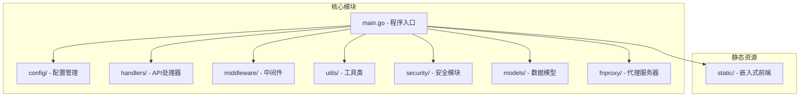
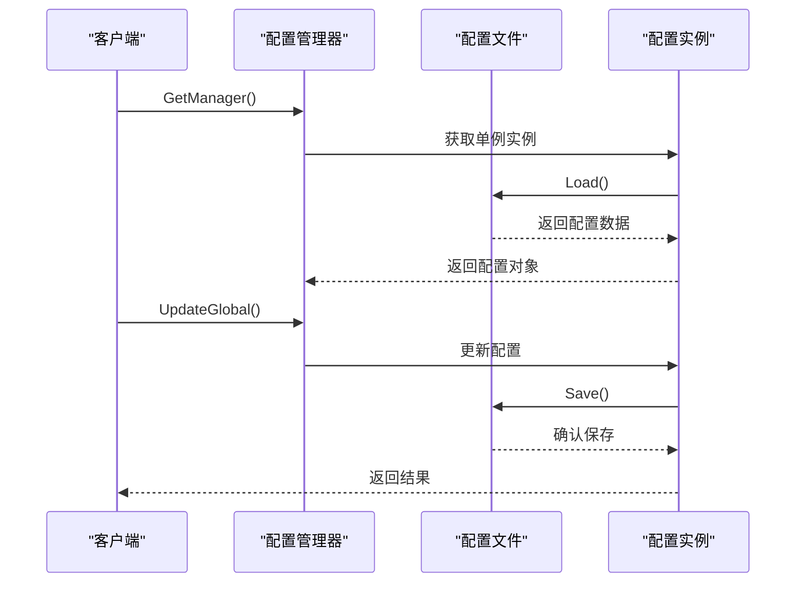
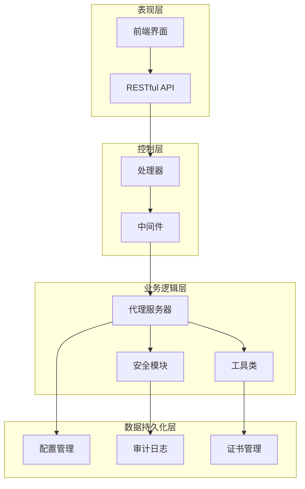
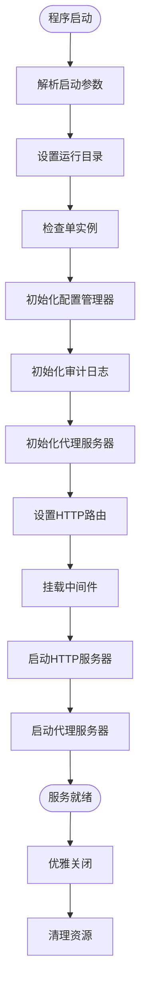
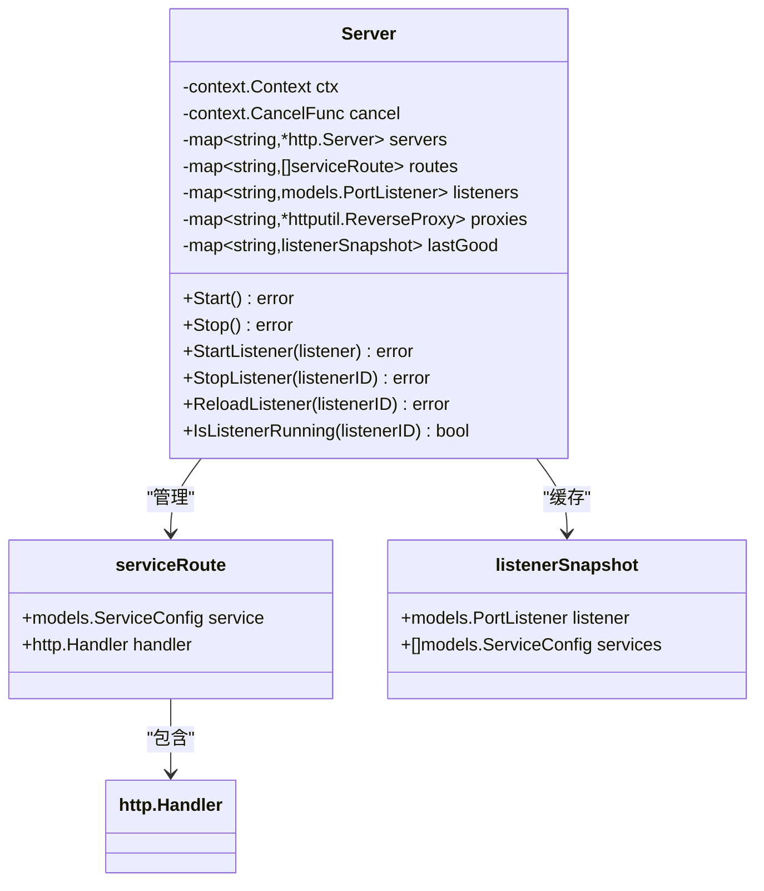
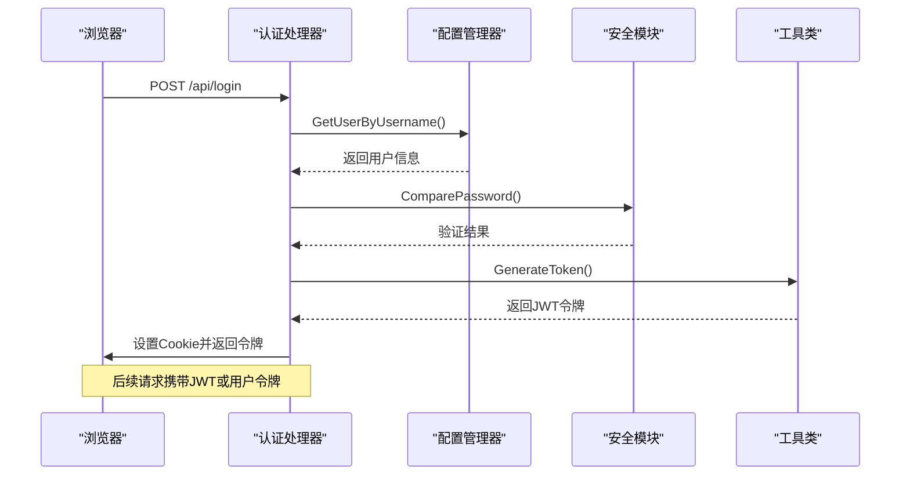
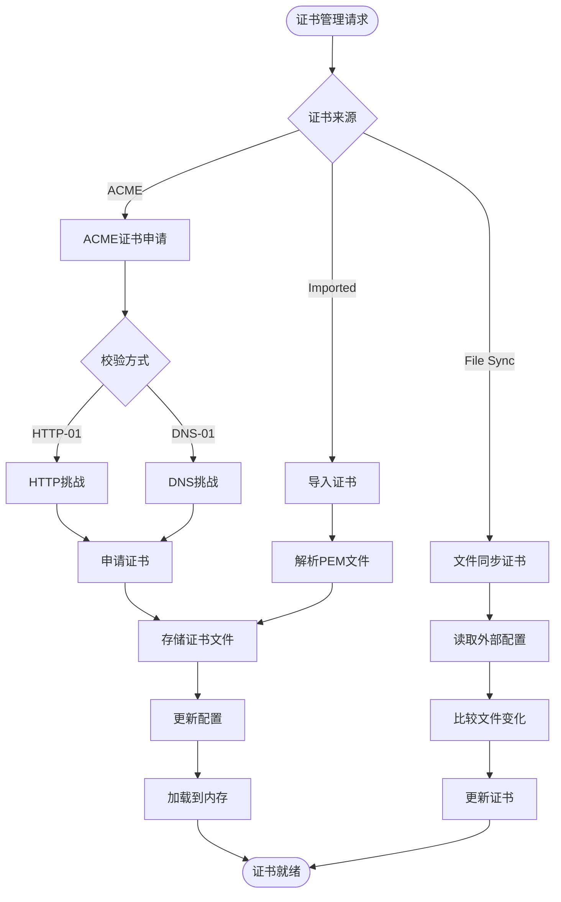
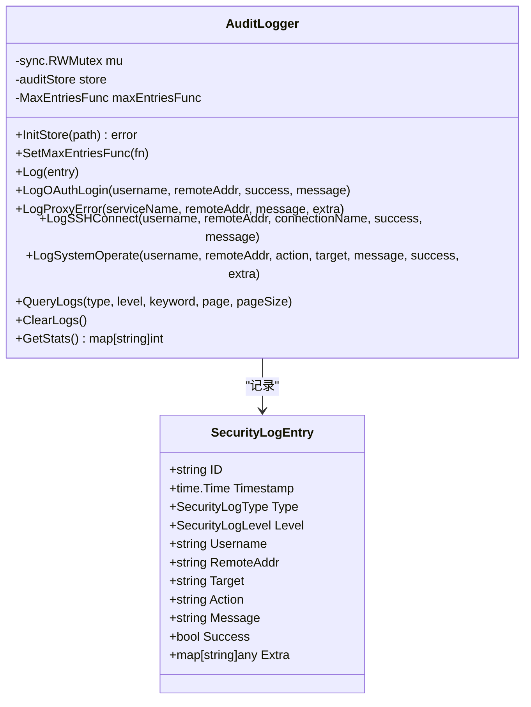
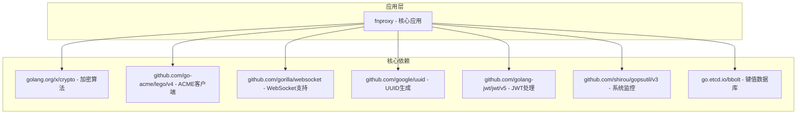

# 网站管理

<cite>
**本文档引用的文件**
- [src/main.go](file://src/main.go)
- [README.md](file://README.md)
- [src/go.mod](file://src/go.mod)
- [src/models/models.go](file://src/models/models.go)
- [src/config/manager.go](file://src/config/manager.go)
- [src/handlers/api.go](file://src/handlers/api.go)
- [src/handlers/auth.go](file://src/handlers/auth.go)
- [src/utils/certificate_manager.go](file://src/utils/certificate_manager.go)
- [src/security/audit_log.go](file://src/security/audit_log.go)
- [src/middleware/auth.go](file://src/middleware/auth.go)
- [src/fnproxy/server.go](file://src/fnproxy/server.go)
- [src/utils/system.go](file://src/utils/system.go)
- [src/process_control.go](file://src/process_control.go)
- [src/static/index.html](file://src/static/index.html)
</cite>

## 目录
1. [项目概述](#项目概述)
2. [项目结构](#项目结构)
3. [核心组件](#核心组件)
4. [架构概览](#架构概览)
5. [详细组件分析](#详细组件分析)
6. [依赖关系分析](#依赖关系分析)
7. [性能考虑](#性能考虑)
8. [故障排除指南](#故障排除指南)
9. [结论](#结论)

## 项目概述

网站管理是一个基于 Go 语言开发的轻量级服务管理面板，用于统一管理网站管理、反向代理、静态站点、跳转规则、证书、OAuth 访问控制、用户、SSH 终端和运行状态。该项目采用模块化设计，将前端静态资源内嵌到可执行文件中，支持跨平台运行。

### 主要特性

- **网站管理**：支持 HTTP/HTTPS 监听，支持启停、热重载、状态查看
- **服务规则管理**：支持反向代理、静态文件、重定向、URL 跳转、文本输出
- **HTTPS 证书管理**：支持导入证书、外部证书文件同步、ACME 自动申请与自动续期
- **动态证书选择**：HTTPS 可按域名自动匹配证书，未命中时使用内嵌默认回退证书
- **OAuth 访问控制**：服务级启用认证，未登录时跳转到当前服务下的 `/OAuth`
- **用户管理**：支持新增、编辑、启停、删除用户，支持密码加密存储
- **Token 鉴权**：用户可配置独立 token，请求头携带后可直接视为已登录
- **SSH/终端管理**：支持本机终端、远程 SSH、连接测试、会话恢复
- **运行监控**：提供状态、流量、连接数、访问日志等数据
- **进程控制**：支持 `status`、`stop`、`restart`，并带 PID 单实例保护

## 项目结构

项目采用清晰的模块化组织结构，主要分为以下几个核心模块：



**图表来源**
- [src/main.go:1-516](file://src/main.go#L1-L516)
- [src/config/manager.go:1-739](file://src/config/manager.go#L1-L739)

### 目录结构详解

- **src/**: Go 模块根目录，包含所有源代码
- **src/config/**: 配置管理相关代码，负责应用配置的持久化和管理
- **src/handlers/**: HTTP 请求处理器，实现 RESTful API 接口
- **src/middleware/**: HTTP 中间件，提供认证、CORS、日志等功能
- **src/utils/**: 工具类库，包括证书管理、系统监控等
- **src/security/**: 安全相关功能，包括审计日志、密码加密等
- **src/models/**: 数据模型定义，描述应用的数据结构
- **src/fnproxy/**: 核心代理服务器实现
- **src/static/**: 嵌入式前端静态资源

**章节来源**
- [README.md:20-42](file://README.md#L20-L42)

## 核心组件

### 数据模型层

项目使用结构化的数据模型来描述各种资源：

```mermaid
classDiagram
class AppConfig {
+Global GlobalConfig
+Listeners []PortListener
+Services []ServiceConfig
+Certs []CertificateConfig
+Users []User
+SSH []SSHConnection
+Firewall *FirewallConfig
}
class PortListener {
+string ID
+int Port
+string Protocol
+bool Enabled
+time.Time CreatedAt
+time.Time UpdatedAt
}
class ServiceConfig {
+string ID
+string PortID
+string Name
+ServiceType Type
+string Domain
+int SortOrder
+string CertificateID
+bool Enabled
+interface{} Config
+bool RequireAuth
+time.Time CreatedAt
+time.Time UpdatedAt
}
class CertificateConfig {
+string ID
+string Name
+[]string Domains
+CertificateSource Source
+CertificateChallengeType ChallengeType
+CertificateDNSProvider DNSProvider
+CertificateStatus Status
+string CertPath
+string KeyPath
+time.Time ExpiresAt
+time.Time NextRenewAt
+time.Time CreatedAt
+time.Time UpdatedAt
}
class User {
+string ID
+string Username
+string Password
+string Token
+string Email
+bool Enabled
+string Role
+time.Time CreatedAt
+time.Time UpdatedAt
}
AppConfig --> PortListener : "包含"
AppConfig --> ServiceConfig : "包含"
AppConfig --> CertificateConfig : "包含"
AppConfig --> User : "包含"
ServiceConfig --> PortListener : "属于"
```

**图表来源**
- [src/models/models.go:72-393](file://src/models/models.go#L72-L393)

### 配置管理系统

配置管理器采用单例模式，提供线程安全的配置读写操作：



**图表来源**
- [src/config/manager.go:40-112](file://src/config/manager.go#L40-L112)

**章节来源**
- [src/models/models.go:1-393](file://src/models/models.go#L1-L393)
- [src/config/manager.go:1-739](file://src/config/manager.go#L1-L739)

## 架构概览

系统采用分层架构设计，各层职责明确，耦合度低：



**图表来源**
- [src/main.go:112-431](file://src/main.go#L112-L431)
- [src/handlers/api.go:1-806](file://src/handlers/api.go#L1-L806)

### 核心流程

系统启动时的完整流程如下：



**图表来源**
- [src/main.go:24-516](file://src/main.go#L24-L516)

## 详细组件分析

### 代理服务器组件

代理服务器是系统的核心组件，负责处理 HTTP/HTTPS 请求并将其转发到相应的后端服务：



**图表来源**
- [src/fnproxy/server.go:37-54](file://src/fnproxy/server.go#L37-L54)

#### 服务类型支持

系统支持多种服务类型，每种类型都有专门的处理器：

| 服务类型 | 功能描述 | 配置参数 |
|---------|----------|----------|
| reverse_proxy | 反向代理 | upstream, timeout, preserve_host, strip_path_prefix |
| static | 静态文件服务 | root, index, browse, access_log |
| redirect | HTTP重定向 | to, status_code |
| url_jump | URL跳转 | target_url, preserve_path |
| text_output | 文本输出 | content_type, body, status_code |

**章节来源**
- [src/fnproxy/server.go:442-584](file://src/fnproxy/server.go#L442-L584)
- [src/models/models.go:82-163](file://src/models/models.go#L82-L163)

### 认证与授权系统

系统提供多层次的身份验证机制：



**图表来源**
- [src/handlers/auth.go:37-76](file://src/handlers/auth.go#L37-L76)

#### 认证流程

系统支持多种认证方式：

1. **JWT Cookie 认证**：用户登录后获得 JWT 令牌，存储在 Cookie 中
2. **Header Token 认证**：支持 `Auth: 32位随机token` 和 `Authorization: Bearer 32位随机token`
3. **OAuth 认证**：服务级 OAuth 认证，支持管理后台登录

**章节来源**
- [src/handlers/auth.go:1-266](file://src/handlers/auth.go#L1-L266)
- [src/middleware/auth.go:14-55](file://src/middleware/auth.go#L14-L55)

### 证书管理系统

证书管理器提供完整的 ACME 证书生命周期管理：



**图表来源**
- [src/utils/certificate_manager.go:440-533](file://src/utils/certificate_manager.go#L440-L533)

#### 支持的证书来源

| 证书来源 | 特性 | 自动续签 | DNS提供商 |
|---------|------|----------|-----------|
| ACME | 自动申请和续签 | ✅ 支持 | HTTP-01, DNS-01 |
| Imported | 手动导入 | ❌ 不支持 | 无 |
| File Sync | 外部文件同步 | ❌ 不支持 | 无 |

**章节来源**
- [src/utils/certificate_manager.go:1-800](file://src/utils/certificate_manager.go#L1-L800)
- [src/models/models.go:165-254](file://src/models/models.go#L165-L254)

### 安全审计系统

安全审计系统记录所有重要的安全事件：



**图表来源**
- [src/security/audit_log.go:15-80](file://src/security/audit_log.go#L15-L80)

#### 审计日志类型

| 日志类型 | 描述 | 级别 |
|---------|------|------|
| oauth_login | OAuth 登录 | Info/Warning |
| proxy_error | 代理错误 | Error |
| ssh_connect | SSH 连接 | Info/Warning |
| system_operate | 系统操作 | Info/Warning |

**章节来源**
- [src/security/audit_log.go:1-224](file://src/security/audit_log.go#L1-L224)

## 依赖关系分析

项目使用 Go modules 管理依赖，主要依赖包括：



**图表来源**
- [src/go.mod:5-13](file://src/go.mod#L5-L13)

### 外部依赖分析

| 依赖包 | 版本 | 用途 | 重要性 |
|--------|------|------|--------|
| golang.org/x/crypto | v0.48.0 | 加密算法、TLS | 核心 |
| github.com/go-acme/lego/v4 | v4.32.0 | ACME 证书申请 | 核心 |
| github.com/gorilla/websocket | v1.5.3 | WebSocket 支持 | 重要 |
| github.com/google/uuid | v1.6.0 | UUID 生成 | 重要 |
| github.com/golang-jwt/jwt/v5 | v5.3.1 | JWT 处理 | 核心 |
| github.com/shirou/gopsutil/v3 | v3.24.5 | 系统监控 | 重要 |
| go.etcd.io/bbolt | v1.4.3 | 本地存储 | 重要 |

**章节来源**
- [src/go.mod:1-48](file://src/go.mod#L1-L48)

## 性能考虑

### 连接池优化

系统使用全局共享的 HTTP 传输连接池，优化网络性能：

- **最大空闲连接数**: 200
- **每主机最大空闲连接数**: 50  
- **每主机最大连接数**: 100
- **空闲连接超时**: 90 秒
- **TLS 握手超时**: 10 秒
- **响应头超时**: 60 秒

### 内存管理

- 使用确定性随机数生成器确保 WebSocket 代理的稳定性
- 实现内存 HTTP-01 挑战提供程序，减少内存占用
- 证书加载采用延迟策略，避免不必要的内存消耗

### 并发处理

- 配置管理器使用读写锁，提高并发读取性能
- 代理服务器支持热更新，无需重启即可应用配置更改
- 审计日志采用异步写入，避免阻塞主请求处理

## 故障排除指南

### 常见问题及解决方案

#### 1. 端口占用问题

**症状**: 启动时提示端口已被占用
**原因**: 监听端口已被其他进程占用
**解决方法**: 
- 更换监听端口
- 检查并终止占用端口的进程
- 使用 `status` 参数检查进程状态

#### 2. 证书申请失败

**症状**: ACME 证书申请失败
**可能原因**:
- DNS 挑战配置错误
- HTTP-01 挑战需要启用 HTTP 80 监听
- 网络连接问题

**解决方法**:
- 检查 DNS 提供商凭据配置
- 确保 HTTP 80 监听已启用
- 验证网络连通性和防火墙设置

#### 3. 认证失败

**症状**: 用户登录失败或令牌验证失败
**可能原因**:
- 密码错误
- 用户被禁用
- JWT 令牌过期

**解决方法**:
- 检查用户凭据
- 确认用户状态为启用
- 重新生成 JWT 令牌

#### 4. 代理连接错误

**症状**: 反向代理请求失败
**可能原因**:
- 上游服务器不可达
- 代理配置错误
- 网络连接超时

**解决方法**:
- 检查上游服务器状态
- 验证代理配置参数
- 调整超时设置

**章节来源**
- [src/fnproxy/server.go:557-572](file://src/fnproxy/server.go#L557-L572)
- [src/utils/certificate_manager.go:471-481](file://src/utils/certificate_manager.go#L471-L481)

### 调试技巧

1. **查看系统状态**: 使用 `/api/status` 接口获取服务器运行状态
2. **检查日志**: 查看审计日志了解系统操作历史
3. **监控网络**: 使用 `/api/metrics/network-history` 监控网络流量
4. **验证配置**: 使用 `/api/config` 接口检查当前配置

## 结论

网站管理项目是一个功能完整、架构清晰的服务管理平台。其主要优势包括：

### 技术优势

- **模块化设计**: 清晰的分层架构，职责分离明确
- **高性能**: 优化的连接池和并发处理机制
- **安全性**: 多层次的身份验证和完整的审计日志
- **易用性**: 内嵌式前端界面，无需额外部署静态资源

### 应用价值

- **简化运维**: 统一管理多个服务和配置
- **提升安全性**: 提供完善的认证和审计功能
- **降低成本**: 内嵌式设计减少部署复杂度
- **扩展性强**: 模块化架构便于功能扩展

### 发展建议

1. **监控增强**: 可以增加更详细的性能监控指标
2. **告警系统**: 添加系统健康告警功能
3. **配置模板**: 提供常用配置模板
4. **多语言支持**: 增加国际化支持

该项目为中小型企业的服务管理需求提供了优秀的解决方案，具有良好的可维护性和扩展性。