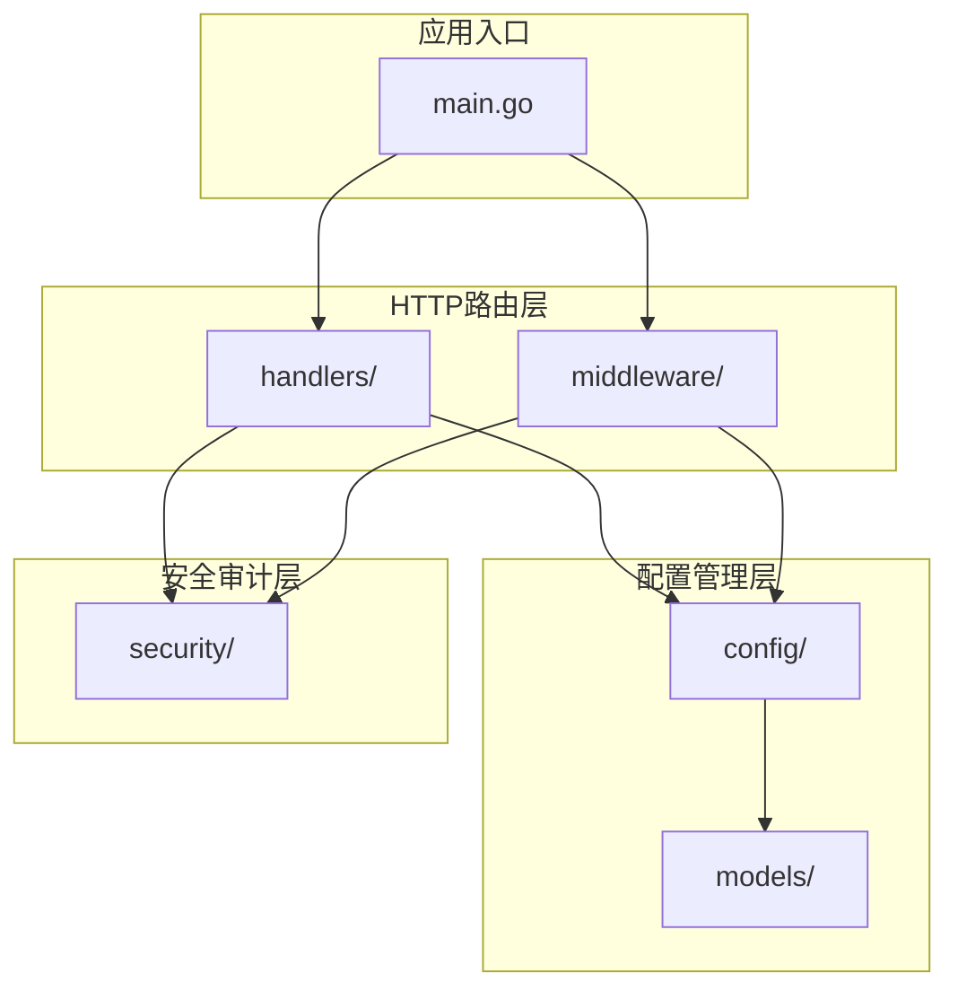
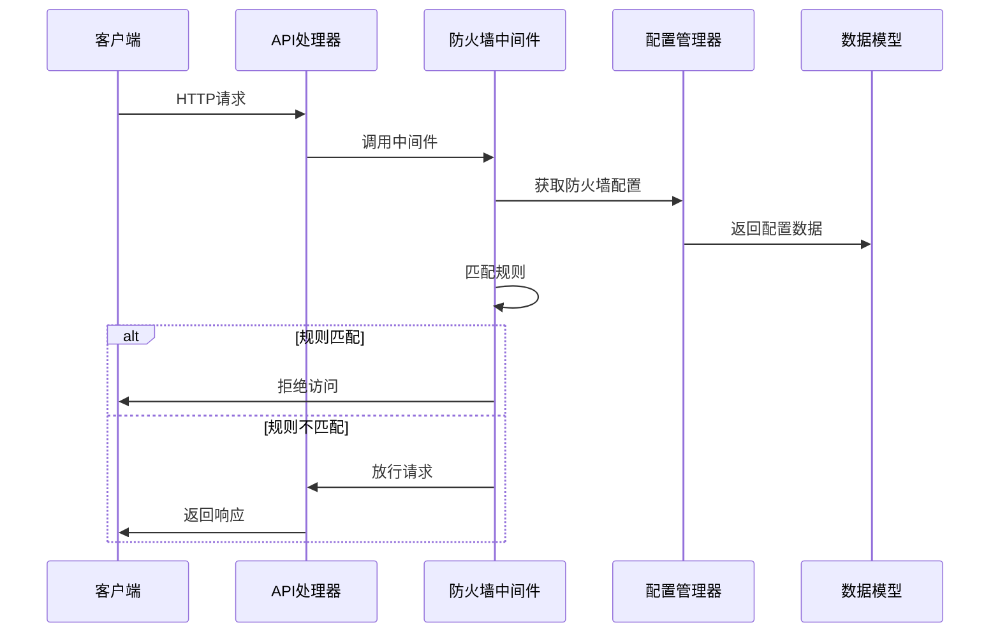
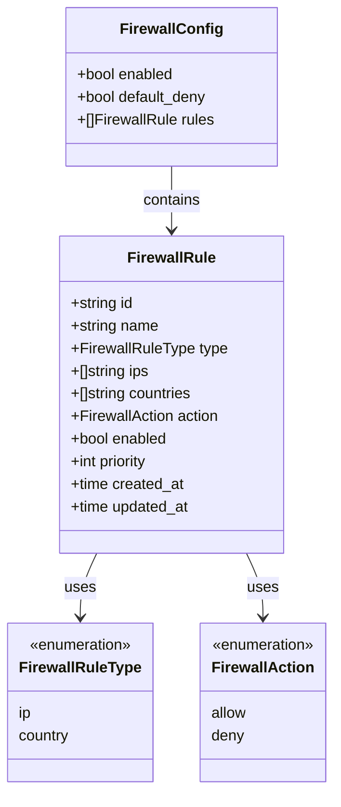
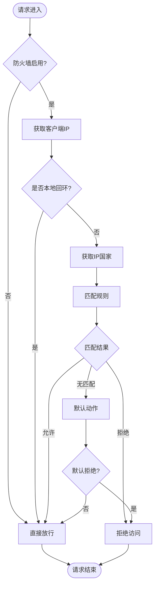
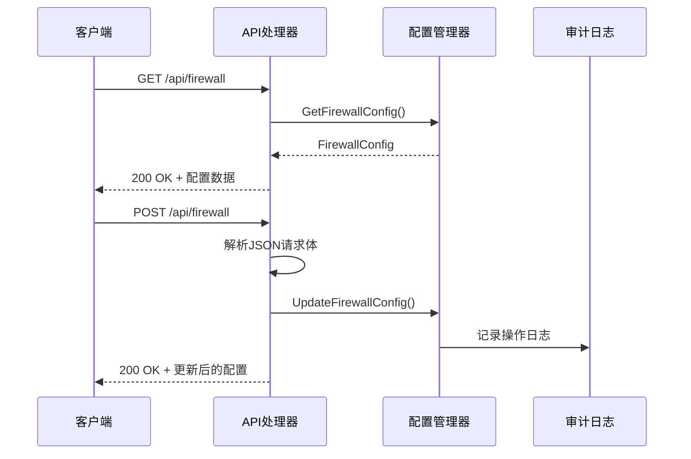
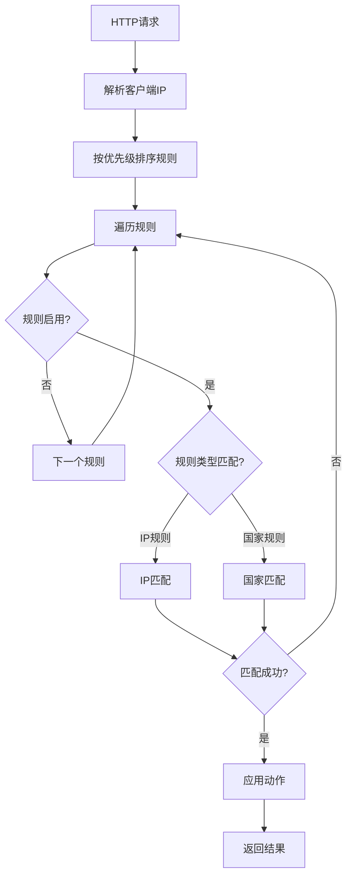
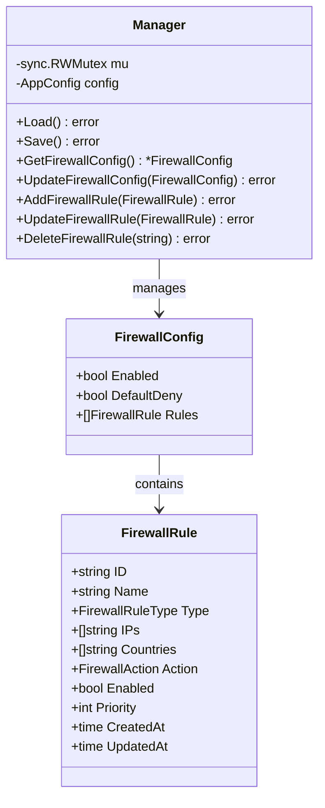
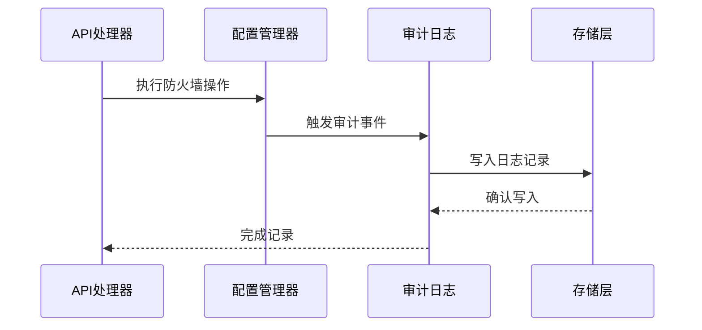
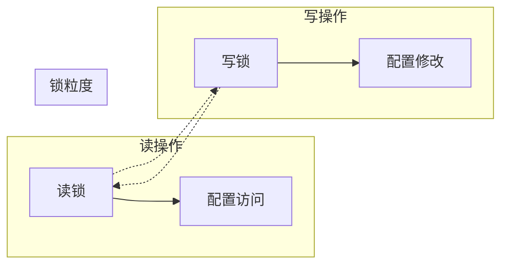

# 防火墙配置管理

<cite>
**本文档引用的文件**
- [main.go](file://src/main.go)
- [firewall.go](file://src/handlers/firewall.go)
- [firewall.go](file://src/middleware/firewall.go)
- [models.go](file://src/models/models.go)
- [manager.go](file://src/config/manager.go)
- [runtime_paths.go](file://src/config/runtime_paths.go)
- [audit_log.go](file://src/security/audit_log.go)
- [README.md](file://README.md)
</cite>

## 目录
1. [简介](#简介)
2. [项目结构](#项目结构)
3. [核心组件](#核心组件)
4. [架构概览](#架构概览)
5. [详细组件分析](#详细组件分析)
6. [防火墙配置管理](#防火墙配置管理)
7. [安全审计集成](#安全审计集成)
8. [性能考虑](#性能考虑)
9. [故障排除指南](#故障排除指南)
10. [结论](#结论)

## 简介

防火墙配置管理系统是 Caddy Panel 服务管理平台的核心安全组件，负责在网络层面对访问请求进行实时过滤和控制。该系统提供了灵活的规则引擎，支持基于IP地址、地理位置和优先级的多维度访问控制，确保只有授权的请求能够访问管理后台和受保护的服务。

系统采用中间件模式实现，能够在HTTP请求到达具体业务逻辑之前进行拦截和处理，提供了强大的安全防护能力。同时集成了完整的安全审计功能，记录所有防火墙相关的操作和事件，便于安全监控和合规审计。

## 项目结构

防火墙系统在整体项目架构中占据重要位置，主要涉及以下模块：



**图表来源**
- [main.go:112-430](file://src/main.go#L112-L430)
- [firewall.go:1-201](file://src/handlers/firewall.go#L1-L201)
- [firewall.go:1-241](file://src/middleware/firewall.go#L1-L241)

**章节来源**
- [main.go:1-516](file://src/main.go#L1-L516)
- [README.md:20-42](file://README.md#L20-L42)

## 核心组件

防火墙系统由四个核心组件构成，每个组件都有明确的职责分工：

### 1. 配置模型层
负责定义防火墙配置的数据结构和验证规则，包括规则类型、动作类型、优先级等。

### 2. 中间件处理器
实现HTTP请求的实时拦截和规则匹配，提供高效的访问控制逻辑。

### 3. API处理器
提供RESTful接口，支持防火墙配置的增删改查操作。

### 4. 配置管理器
负责持久化存储和动态加载防火墙配置，确保配置的原子性和一致性。

**章节来源**
- [models.go:346-393](file://src/models/models.go#L346-L393)
- [manager.go:18-77](file://src/config/manager.go#L18-L77)

## 架构概览

防火墙系统采用分层架构设计，实现了高内聚低耦合的模块化组织：



**图表来源**
- [main.go:422-427](file://src/main.go#L422-L427)
- [firewall.go:13-56](file://src/middleware/firewall.go#L13-L56)

系统的关键特性包括：
- **中间件集成**：作为HTTP中间件无缝集成到请求处理流程
- **配置持久化**：支持动态配置更新和持久化存储
- **规则优先级**：基于优先级的规则匹配算法
- **安全审计**：完整的操作日志记录机制

## 详细组件分析

### 防火墙配置模型

防火墙配置模型定义了完整的数据结构和约束条件：



**图表来源**
- [models.go:376-393](file://src/models/models.go#L376-L393)
- [models.go:346-374](file://src/models/models.go#L346-L374)

### 防火墙中间件实现

防火墙中间件采用责任链模式，实现了高效的请求拦截逻辑：



**图表来源**
- [firewall.go:13-56](file://src/middleware/firewall.go#L13-L56)
- [firewall.go:153-189](file://src/middleware/firewall.go#L153-L189)

**章节来源**
- [firewall.go:13-241](file://src/middleware/firewall.go#L13-L241)

### API处理器实现

防火墙API处理器提供了完整的RESTful接口：



**图表来源**
- [firewall.go:21-68](file://src/handlers/firewall.go#L21-L68)

**章节来源**
- [firewall.go:1-201](file://src/handlers/firewall.go#L1-L201)

## 防火墙配置管理

### 配置数据结构

防火墙配置采用JSON格式存储，支持复杂的规则组合：

| 字段 | 类型 | 描述 | 默认值 |
|------|------|------|--------|
| enabled | boolean | 防火墙总开关 | false |
| default_deny | boolean | 默认拒绝策略 | false |
| rules | array | 规则列表 | [] |

每条规则包含以下字段：
- **id**: 规则唯一标识符
- **name**: 规则名称
- **type**: 规则类型 (ip/country)
- **ips**: IP地址或CIDR列表
- **countries**: 国家代码列表
- **action**: 动作类型 (allow/deny)
- **enabled**: 是否启用
- **priority**: 优先级 (数值越小优先级越高)
- **created_at/updated_at**: 时间戳

### 规则匹配算法

系统采用优先级驱动的规则匹配算法：



**图表来源**
- [firewall.go:153-189](file://src/middleware/firewall.go#L153-L189)

### 配置持久化机制

配置管理器采用读写锁保证并发安全性：



**图表来源**
- [manager.go:18-77](file://src/config/manager.go#L18-L77)
- [manager.go:644-739](file://src/config/manager.go#L644-L739)

**章节来源**
- [manager.go:644-739](file://src/config/manager.go#L644-L739)

## 安全审计集成

防火墙系统与安全审计模块深度集成，提供完整的操作追踪：

### 审计日志类型

系统为防火墙操作记录专门的日志类型：

| 日志类型 | 触发场景 | 记录内容 |
|----------|----------|----------|
| system_operate | 防火墙配置变更 | 启用/禁用防火墙、添加/更新/删除规则 |
| security_log | 安全事件 | 访问被拒绝、异常请求等 |

### 审计日志记录流程



**图表来源**
- [firewall.go:59-67](file://src/handlers/firewall.go#L59-L67)
- [audit_log.go:149-166](file://src/security/audit_log.go#L149-L166)

**章节来源**
- [audit_log.go:1-224](file://src/security/audit_log.go#L1-L224)

## 性能考虑

### 中间件性能优化

防火墙中间件经过精心优化，确保最小的性能开销：

- **内存分配优化**：使用预分配切片减少GC压力
- **规则缓存**：已启用规则的快速查找
- **早期返回**：未启用防火墙时直接放行
- **本地回环优化**：跳过本地IP的复杂匹配逻辑

### 并发安全设计

系统采用读写锁分离的设计模式：



**图表来源**
- [manager.go:18-21](file://src/config/manager.go#L18-L21)

### 内存管理策略

- **配置克隆**：读操作返回配置副本，避免锁持有时间过长
- **规则排序缓存**：已排序规则的临时缓存
- **IP解析缓存**：重复IP解析的结果缓存

## 故障排除指南

### 常见问题诊断

#### 1. 防火墙规则不生效

**可能原因**：
- 防火墙总开关未启用
- 规则优先级设置不当
- IP格式不正确（非CIDR格式）

**解决方法**：
```bash
# 检查防火墙配置
curl -X GET http://localhost:8080/api/firewall

# 验证规则格式
curl -X POST http://localhost:8080/api/firewall/rules -H "Content-Type: application/json" -d '{
  "name": "test-rule",
  "type": "ip",
  "ips": ["192.168.1.0/24"],
  "action": "allow",
  "priority": 1
}'
```

#### 2. 访问被意外拒绝

**排查步骤**：
1. 检查本地回环地址是否被正确识别
2. 验证规则匹配顺序
3. 确认默认拒绝策略设置

#### 3. 性能问题

**监控指标**：
- 请求延迟增加
- CPU使用率上升
- 规则匹配耗时

**优化建议**：
- 减少规则数量
- 合理设置规则优先级
- 使用更精确的IP范围

**章节来源**
- [firewall.go:114-151](file://src/middleware/firewall.go#L114-L151)

### 调试技巧

#### 启用详细日志

在开发环境中可以通过以下方式获取更多信息：

```bash
# 启动时指定详细日志级别
./build/fnproxy-panel-linux-amd64 -log_level=debug

# 查看防火墙匹配过程
curl -v http://localhost:8080/api/firewall
```

#### 配置验证

使用JSON Schema验证防火墙配置的有效性：

```json
{
  "enabled": true,
  "default_deny": false,
  "rules": [
    {
      "id": "rule-1",
      "name": "allow-local",
      "type": "ip",
      "ips": ["127.0.0.1/32", "192.168.0.0/16"],
      "action": "allow",
      "priority": 1,
      "enabled": true
    }
  ]
}
```

## 结论

防火墙配置管理系统为Caddy Panel提供了强大而灵活的安全防护能力。通过模块化的架构设计、高效的中间件实现和完善的审计集成，系统能够在保证安全性的前提下提供最佳的用户体验。

系统的主要优势包括：
- **灵活性**：支持多种规则类型和匹配条件
- **性能**：经过优化的中间件实现，最小化性能开销
- **可观测性**：完整的安全审计和日志记录
- **易用性**：直观的API接口和配置管理界面

未来的发展方向包括：
- 集成GeoIP数据库实现精确的地理位置匹配
- 支持更复杂的规则组合和条件表达式
- 提供可视化规则编辑界面
- 增强实时监控和告警功能

通过持续的优化和完善，防火墙系统将成为Caddy Panel安全体系的重要基石，为用户提供可靠的安全保障。