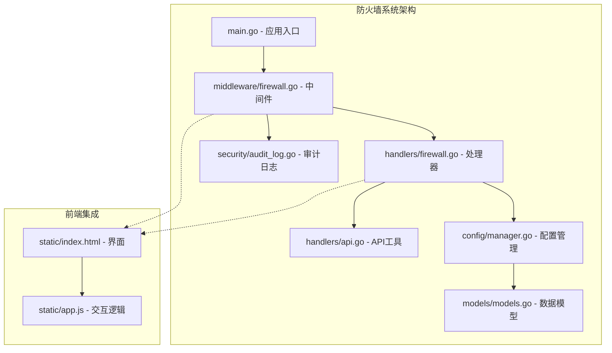
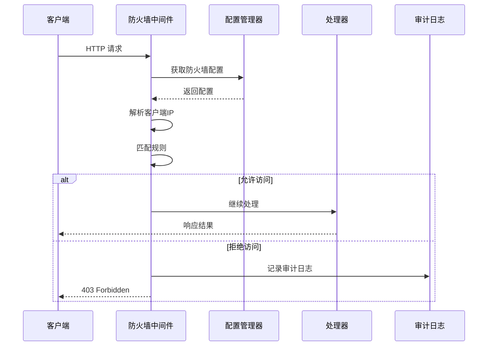
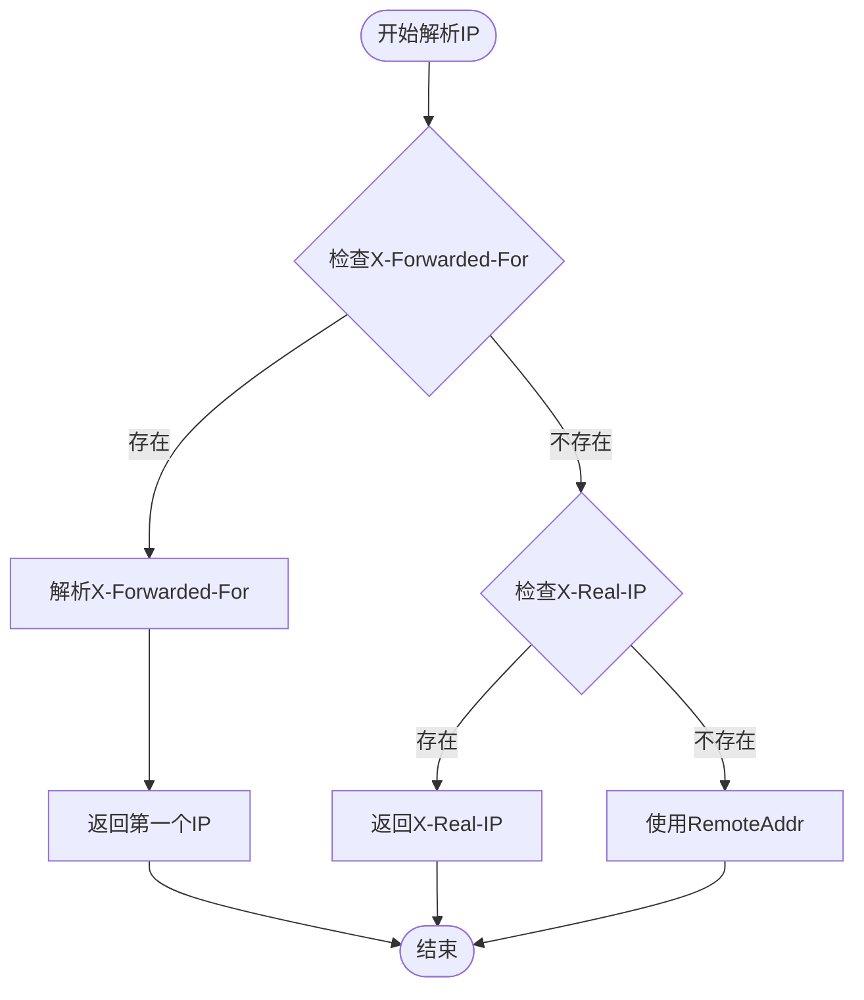
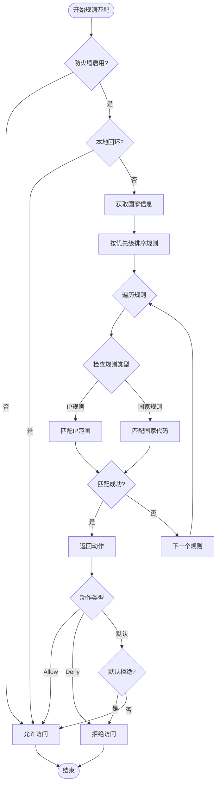
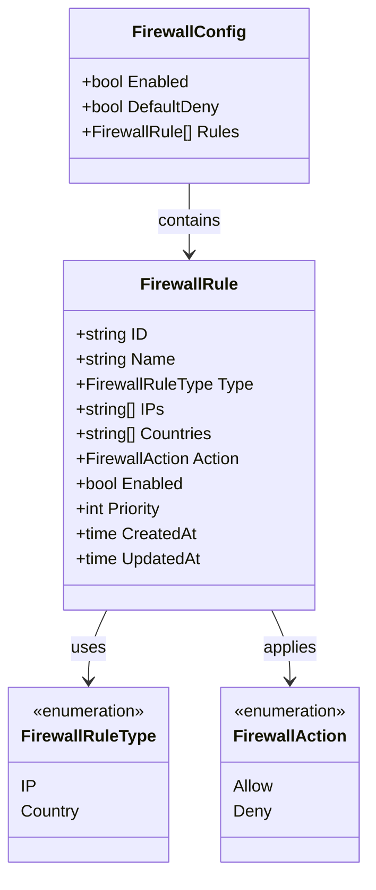
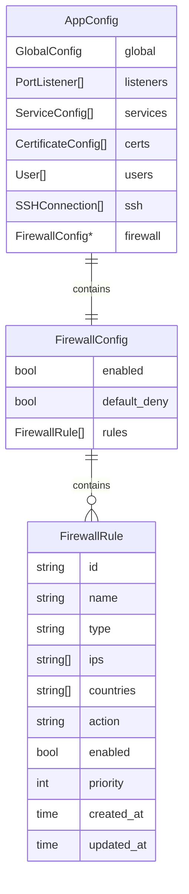
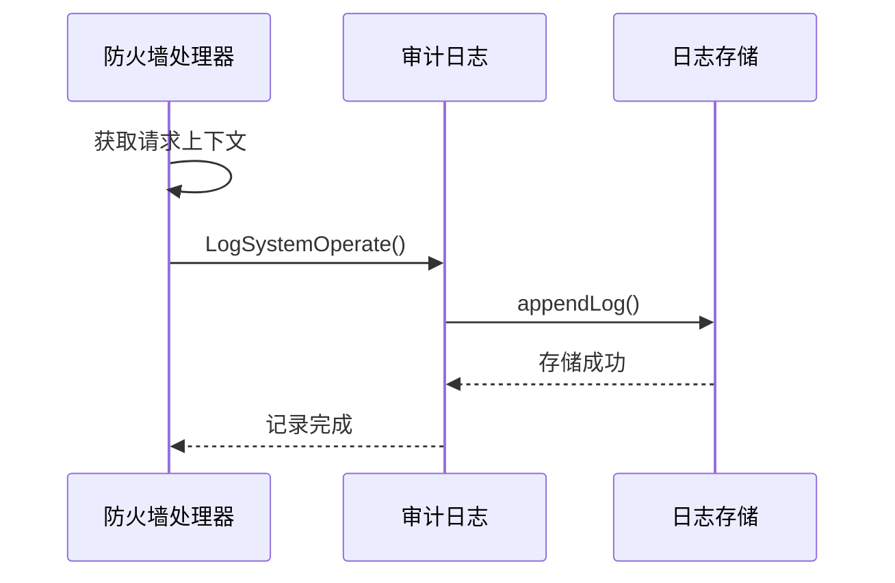
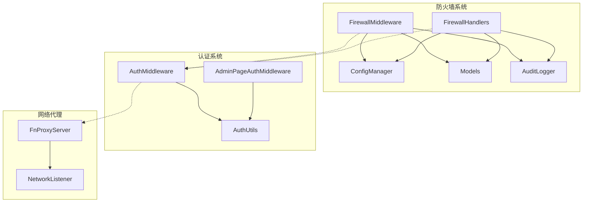

# 防火墙系统

<cite>
**本文档引用的文件**
- [main.go](file://src/main.go)
- [firewall.go](file://src/handlers/firewall.go)
- [firewall.go](file://src/middleware/firewall.go)
- [models.go](file://src/models/models.go)
- [manager.go](file://src/config/manager.go)
- [audit_log.go](file://src/security/audit_log.go)
- [api.go](file://src/handlers/api.go)
- [README.md](file://README.md)
</cite>

## 目录
1. [简介](#简介)
2. [项目结构](#项目结构)
3. [核心组件](#核心组件)
4. [架构概览](#架构概览)
5. [详细组件分析](#详细组件分析)
6. [依赖关系分析](#依赖关系分析)
7. [性能考虑](#性能考虑)
8. [故障排除指南](#故障排除指南)
9. [结论](#结论)

## 简介

防火墙系统是 Caddy Panel 服务管理面板的重要组成部分，提供基于 IP 地址和地理位置的访问控制功能。该系统通过中间件拦截 HTTP 请求，根据预定义的规则集决定是否允许访问，从而增强系统的安全性。

系统支持两种规则类型：IP/IP 段规则和国家/地区规则，具有灵活的优先级管理和默认拒绝策略。所有防火墙操作都会被记录到安全审计日志中，便于追踪和审计。

## 项目结构

防火墙系统主要分布在以下几个核心模块中：

**图表来源**
- [main.go:422-427](file://src/main.go#L422-L427)
- [firewall.go:13-56](file://src/middleware/firewall.go#L13-L56)
- [firewall.go:21-68](file://src/handlers/firewall.go#L21-L68)

**章节来源**
- [main.go:112-431](file://src/main.go#L112-L431)
- [README.md:20-42](file://README.md#L20-L42)

## 核心组件

防火墙系统由四个核心组件构成：

### 1. 防火墙中间件
负责拦截 HTTP 请求并应用访问控制规则，是整个系统的核心执行单元。

### 2. 防火墙处理器
提供 RESTful API 接口，用于管理防火墙配置和规则。

### 3. 配置管理器
负责持久化存储防火墙配置，提供 CRUD 操作接口。

### 4. 数据模型
定义防火墙相关的数据结构，包括配置、规则和操作类型。

**章节来源**
- [firewall.go:13-56](file://src/middleware/firewall.go#L13-L56)
- [firewall.go:21-68](file://src/handlers/firewall.go#L21-L68)
- [models.go:346-381](file://src/models/models.go#L346-L381)

## 架构概览

防火墙系统采用中间件模式，与认证中间件协同工作，形成完整的安全防护体系。

**图表来源**
- [main.go:422-427](file://src/main.go#L422-L427)
- [firewall.go:13-56](file://src/middleware/firewall.go#L13-L56)
- [firewall.go:21-68](file://src/handlers/firewall.go#L21-L68)

## 详细组件分析

### 防火墙中间件

防火墙中间件是系统的核心执行组件，负责实时拦截和处理 HTTP 请求。

#### 核心功能

1. **请求拦截**: 在认证中间件之后执行，确保只有通过认证的请求才会被防火墙检查
2. **IP 地址解析**: 从多种来源提取真实的客户端 IP 地址
3. **规则匹配**: 按优先级顺序匹配防火墙规则
4. **访问决策**: 根据匹配结果决定允许或拒绝访问

#### IP 地址解析流程

**图表来源**
- [firewall.go:58-82](file://src/middleware/firewall.go#L58-L82)

#### 规则匹配算法

**图表来源**
- [firewall.go:153-189](file://src/middleware/firewall.go#L153-L189)

**章节来源**
- [firewall.go:13-56](file://src/middleware/firewall.go#L13-L56)
- [firewall.go:153-241](file://src/middleware/firewall.go#L153-L241)

### 防火墙处理器

处理器层提供 RESTful API 接口，用于管理防火墙配置和规则。

#### API 接口设计

| 方法 | 路径 | 功能 | 描述 |
|------|------|------|------|
| GET | /api/firewall | 获取防火墙配置 | 返回当前防火墙配置状态 |
| POST | /api/firewall | 更新防火墙配置 | 启用/禁用防火墙，设置默认规则 |
| POST | /api/firewall/rules | 添加规则 | 创建新的防火墙规则 |
| PUT | /api/firewall/rules/{id} | 更新规则 | 修改现有规则配置 |
| DELETE | /api/firewall/rules/{id} | 删除规则 | 移除指定防火墙规则 |

#### 规则类型和动作

**图表来源**
- [models.go:346-381](file://src/models/models.go#L346-L381)
- [models.go:362-374](file://src/models/models.go#L362-L374)

**章节来源**
- [firewall.go:21-201](file://src/handlers/firewall.go#L21-L201)
- [models.go:346-381](file://src/models/models.go#L346-L381)

### 配置管理器

配置管理器负责持久化存储防火墙配置，提供完整的 CRUD 操作。

#### 配置存储结构

防火墙配置存储在主配置文件中，采用嵌套结构：

**图表来源**
- [models.go:383-392](file://src/models/models.go#L383-L392)
- [manager.go:644-738](file://src/config/manager.go#L644-L738)

**章节来源**
- [manager.go:644-738](file://src/config/manager.go#L644-L738)

### 审计日志集成

所有防火墙操作都会被记录到安全审计日志中，确保操作的可追溯性。

#### 审计日志记录

**图表来源**
- [firewall.go:59-67](file://src/handlers/firewall.go#L59-L67)
- [audit_log.go:149-166](file://src/security/audit_log.go#L149-L166)

**章节来源**
- [audit_log.go:149-166](file://src/security/audit_log.go#L149-L166)

## 依赖关系分析

防火墙系统与其他组件的依赖关系如下：

**图表来源**
- [main.go:422-427](file://src/main.go#L422-L427)
- [firewall.go:13-56](file://src/middleware/firewall.go#L13-L56)

### 关键依赖特性

1. **配置共享**: 防火墙配置与主配置文件共享，确保一致性
2. **中间件链**: 与认证中间件协同工作，形成多层防护
3. **审计集成**: 无缝集成到安全审计系统中
4. **线程安全**: 使用互斥锁确保并发访问的安全性

**章节来源**
- [main.go:422-427](file://src/main.go#L422-L427)
- [manager.go:18-35](file://src/config/manager.go#L18-L35)

## 性能考虑

防火墙系统在设计时充分考虑了性能优化：

### 1. 规则匹配优化
- **优先级排序**: 规则按优先级排序，避免不必要的匹配
- **短路求值**: 一旦找到匹配规则立即返回结果
- **内存复用**: 复制规则数组以避免竞态条件

### 2. IP 地址处理优化
- **CIDR 缓存**: CIDR 范围解析结果可被缓存
- **快速路径**: 本地回环地址和私有地址快速通道
- **批量处理**: 支持批量 IP 地址解析

### 3. 内存管理
- **对象池**: 复用临时对象减少 GC 压力
- **延迟加载**: 配置按需加载，避免不必要的初始化
- **并发安全**: 使用 RWMutex 实现读写分离

## 故障排除指南

### 常见问题及解决方案

#### 1. 防火墙规则不生效

**可能原因**:
- 防火墙未启用
- 规则优先级设置不当
- IP 地址解析错误

**排查步骤**:
1. 检查防火墙配置状态
2. 验证规则优先级顺序
3. 确认客户端 IP 地址解析正确

#### 2. 访问被意外拒绝

**可能原因**:
- 默认拒绝策略启用
- 本地网络被误判
- 规则匹配逻辑错误

**解决方法**:
1. 检查 `default_deny` 设置
2. 添加本地网络白名单
3. 调整规则匹配条件

#### 3. 审计日志缺失

**排查方法**:
1. 确认审计日志存储初始化
2. 检查日志级别配置
3. 验证磁盘空间充足

**章节来源**
- [firewall.go:13-56](file://src/middleware/firewall.go#L13-L56)
- [audit_log.go:33-44](file://src/security/audit_log.go#L33-L44)

## 结论

防火墙系统为 Caddy Panel 提供了强大的访问控制能力，具有以下特点：

### 技术优势
- **模块化设计**: 清晰的职责分离，易于维护和扩展
- **高性能实现**: 优化的规则匹配算法，满足高并发场景
- **完整审计**: 全面的操作记录，确保合规性
- **灵活配置**: 支持多种规则类型和复杂的匹配逻辑

### 安全特性
- **多层防护**: 与认证系统协同工作
- **实时监控**: 实时拦截和记录可疑访问
- **可追溯性**: 完整的操作审计日志
- **默认安全**: 默认拒绝策略确保最小权限原则

### 扩展潜力
- **地理定位**: 支持集成 GeoIP 库进行精确的地理位置匹配
- **动态规则**: 支持基于时间、频率等条件的动态规则
- **机器学习**: 可集成异常检测算法识别潜在威胁
- **分布式部署**: 支持多节点协调的统一防火墙策略

防火墙系统作为 Caddy Panel 的重要安全组件，为用户提供了可靠、高效、易用的访问控制解决方案，是构建企业级应用安全防护体系的重要基石。