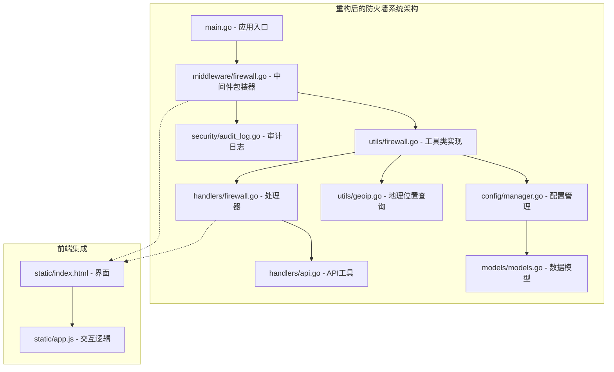
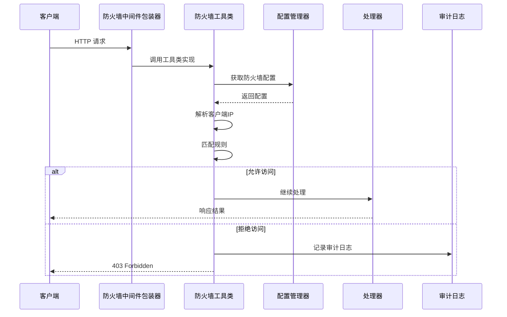
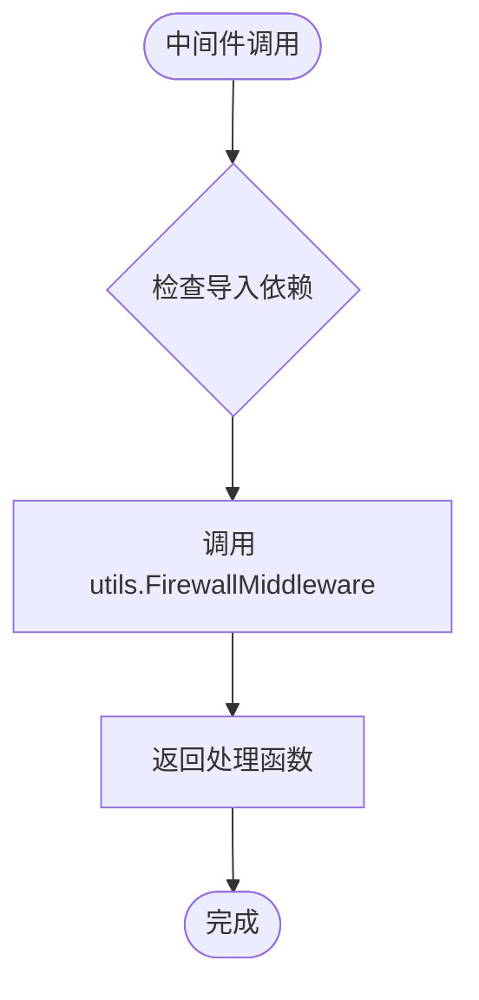
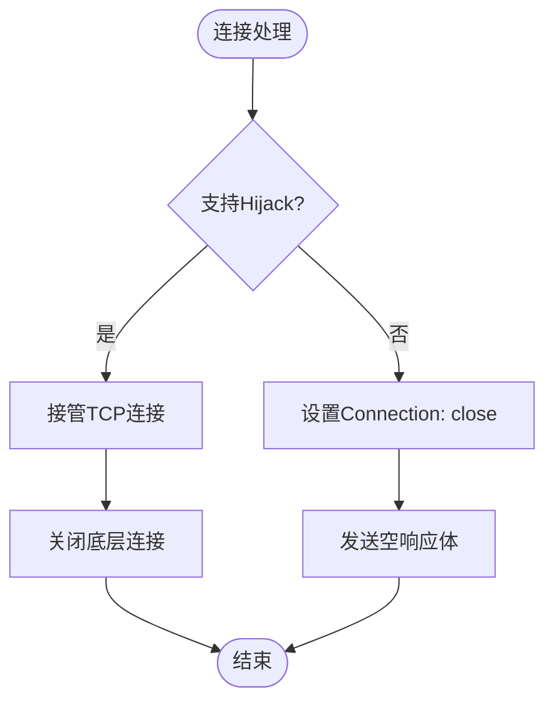
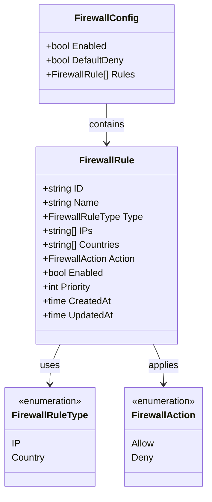
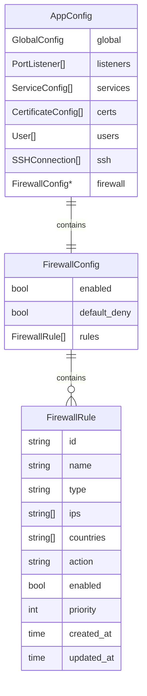
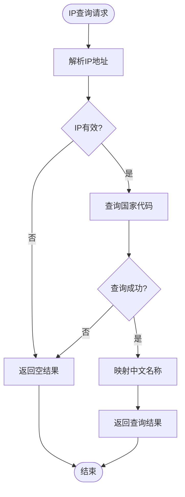
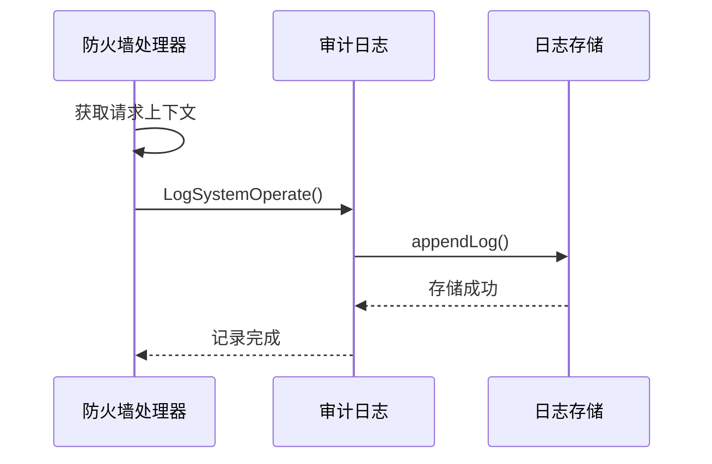
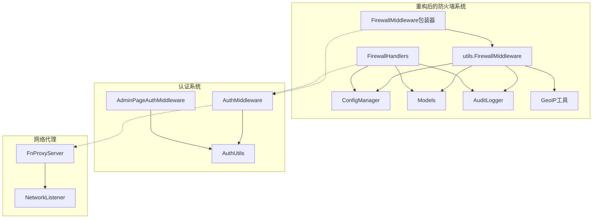

# 防火墙系统

<cite>
**本文档引用的文件**
- [main.go](file://src/main.go)
- [firewall.go](file://src/handlers/firewall.go)
- [firewall.go](file://src/middleware/firewall.go)
- [firewall.go](file://src/utils/firewall.go)
- [models.go](file://src/models/models.go)
- [manager.go](file://src/config/manager.go)
- [audit_log.go](file://src/security/audit_log.go)
- [geoip.go](file://src/utils/geoip.go)
- [api.go](file://src/handlers/api.go)
- [README.md](file://README.md)
</cite>

## 更新摘要
**变更内容**
- 更新防火墙架构图以反映中间件到工具类的重构
- 新增工具类实现细节和职责分离说明
- 更新核心组件分析以包含新的工具类结构
- 更新依赖关系分析以反映新的包组织方式
- 新增防火墙工具类的详细技术分析

## 目录
1. [简介](#简介)
2. [项目结构](#项目结构)
3. [核心组件](#核心组件)
4. [架构概览](#架构概览)
5. [详细组件分析](#详细组件分析)
6. [依赖关系分析](#依赖关系分析)
7. [性能考虑](#性能考虑)
8. [故障排除指南](#故障排除指南)
9. [结论](#结论)

## 简介

防火墙系统是 Caddy Panel 服务管理面板的重要组成部分，提供基于 IP 地址和地理位置的访问控制功能。该系统通过中间件拦截 HTTP 请求，根据预定义的规则集决定是否允许访问，从而增强系统的安全性。

**重构后**，防火墙系统采用新的架构模式：核心业务逻辑已重构到工具类（src/utils/firewall.go），中间件仅作为轻量级包装器委托给工具类实现。这种设计消除了包循环依赖问题，提高了代码的可维护性和可测试性。

系统支持两种规则类型：IP/IP 段规则和国家/地区规则，具有灵活的优先级管理和默认拒绝策略。所有防火墙操作都会被记录到安全审计日志中，便于追踪和审计。

## 项目结构

防火墙系统主要分布在以下几个核心模块中，**重构后**采用了更清晰的职责分离：

**图表来源**
- [main.go:436](file://src/main.go#L436)
- [firewall.go:11-13](file://src/middleware/firewall.go#L11-L13)
- [firewall.go:13-54](file://src/utils/firewall.go#L13-L54)

**章节来源**
- [main.go:420-518](file://src/main.go#L420-L518)
- [README.md:20-42](file://README.md#L20-L42)

## 核心组件

防火墙系统由五个核心组件构成，**重构后**实现了更好的职责分离：

### 1. 防火墙中间件包装器
轻量级包装器，负责将 HTTP 请求委托给工具类实现，避免包循环依赖问题。

### 2. 防火墙工具类
包含完整的防火墙业务逻辑，包括 IP 地址解析、规则匹配、连接处理等功能。

### 3. 防火墙处理器
提供 RESTful API 接口，用于管理防火墙配置和规则。

### 4. 配置管理器
负责持久化存储防火墙配置，提供 CRUD 操作接口。

### 5. 地理位置查询工具
提供 IP 地址到国家/地区的映射功能，支持内置的 iploc 库。

**章节来源**
- [firewall.go:11-13](file://src/middleware/firewall.go#L11-L13)
- [firewall.go:13-54](file://src/utils/firewall.go#L13-L54)
- [firewall.go:21-201](file://src/handlers/firewall.go#L21-L201)
- [models.go:346-393](file://src/models/models.go#L346-L393)

## 架构概览

防火墙系统采用中间件模式，与认证中间件协同工作，形成完整的安全防护体系。**重构后**的架构更加清晰，消除了包循环依赖问题。

**图表来源**
- [main.go:436](file://src/main.go#L436)
- [firewall.go:11-13](file://src/middleware/firewall.go#L11-L13)
- [firewall.go:13-54](file://src/utils/firewall.go#L13-L54)

## 详细组件分析

### 防火墙中间件包装器

**重构后**，防火墙中间件仅作为轻量级包装器存在，负责将 HTTP 请求委托给工具类实现。

#### 核心功能

1. **请求转发**: 将 HTTP 请求委托给工具类的 FirewallMiddleware 函数
2. **依赖注入**: 避免与 fnproxy 包的循环依赖问题
3. **简单封装**: 保持中间件接口的一致性

#### 包装器实现

**图表来源**
- [firewall.go:11-13](file://src/middleware/firewall.go#L11-L13)

**章节来源**
- [firewall.go:11-13](file://src/middleware/firewall.go#L11-L13)

### 防火墙工具类

**重构后**的核心业务逻辑，包含完整的防火墙实现。

#### 核心功能

1. **请求拦截**: 在认证中间件之后执行，确保只有通过认证的请求才会被防火墙检查
2. **IP 地址解析**: 从多种来源提取真实的客户端 IP 地址
3. **规则匹配**: 按优先级顺序匹配防火墙规则
4. **访问决策**: 根据匹配结果决定允许或拒绝访问
5. **连接处理**: 实现 DROP 行为，直接关闭连接

#### IP 地址解析流程

**图表来源**
- [firewall.go:70-87](file://src/utils/firewall.go#L70-L87)

#### 规则匹配算法

**图表来源**
- [firewall.go:105-133](file://src/utils/firewall.go#L105-L133)

#### 连接处理机制

**图表来源**
- [firewall.go:56-68](file://src/utils/firewall.go#L56-L68)

**章节来源**
- [firewall.go:13-54](file://src/utils/firewall.go#L13-L54)
- [firewall.go:105-173](file://src/utils/firewall.go#L105-L173)

### 防火墙处理器

处理器层提供 RESTful API 接口，用于管理防火墙配置和规则。

#### API 接口设计

| 方法 | 路径 | 功能 | 描述 |
|------|------|------|------|
| GET | /api/firewall | 获取防火墙配置 | 返回当前防火墙配置状态 |
| POST | /api/firewall | 更新防火墙配置 | 启用/禁用防火墙，设置默认规则 |
| POST | /api/firewall/rules | 添加规则 | 创建新的防火墙规则 |
| PUT | /api/firewall/rules/{id} | 更新规则 | 修改现有规则配置 |
| DELETE | /api/firewall/rules/{id} | 删除规则 | 移除指定防火墙规则 |

#### 规则类型和动作

**图表来源**
- [models.go:346-393](file://src/models/models.go#L346-L393)

**章节来源**
- [firewall.go:21-201](file://src/handlers/firewall.go#L21-L201)
- [models.go:346-393](file://src/models/models.go#L346-L393)

### 配置管理器

配置管理器负责持久化存储防火墙配置，提供完整的 CRUD 操作。

#### 配置存储结构

防火墙配置存储在主配置文件中，采用嵌套结构：

**图表来源**
- [models.go:376-393](file://src/models/models.go#L376-L393)
- [manager.go:644-739](file://src/config/manager.go#L644-L739)

**章节来源**
- [manager.go:644-739](file://src/config/manager.go#L644-L739)

### 地理位置查询工具

**新增**的地理位置查询功能，支持 IP 地址到国家/地区的映射。

#### IP 地址查询流程

**图表来源**
- [geoip.go:53-69](file://src/utils/geoip.go#L53-L69)

**章节来源**
- [geoip.go:1-71](file://src/utils/geoip.go#L1-L71)

### 审计日志集成

所有防火墙操作都会被记录到安全审计日志中，确保操作的可追溯性。

#### 审计日志记录

**图表来源**
- [firewall.go:59-67](file://src/handlers/firewall.go#L59-L67)
- [audit_log.go:149-166](file://src/security/audit_log.go#L149-L166)

**章节来源**
- [audit_log.go:149-166](file://src/security/audit_log.go#L149-L166)

## 依赖关系分析

**重构后**的防火墙系统与其他组件的依赖关系更加清晰，消除了包循环依赖问题：

**图表来源**
- [main.go:436](file://src/main.go#L436)
- [firewall.go:11-13](file://src/middleware/firewall.go#L11-L13)

### 关键依赖特性

1. **职责分离**: 防火墙工具类独立于中间件，便于测试和维护
2. **包循环避免**: 通过工具类模式避免了包循环依赖问题
3. **配置共享**: 防火墙配置与主配置文件共享，确保一致性
4. **中间件链**: 与认证中间件协同工作，形成多层防护
5. **审计集成**: 无缝集成到安全审计系统中
6. **地理位置支持**: 内置 IP 到国家映射功能

**章节来源**
- [main.go:436](file://src/main.go#L436)
- [manager.go:644-658](file://src/config/manager.go#L644-L658)

## 性能考虑

防火墙系统在设计时充分考虑了性能优化，**重构后**的架构进一步提升了性能表现：

### 1. 规则匹配优化
- **优先级排序**: 规则按优先级排序，避免不必要的匹配
- **短路求值**: 一旦找到匹配规则立即返回结果
- **内存复用**: 复制规则数组以避免竞态条件

### 2. IP 地址处理优化
- **CIDR 缓存**: CIDR 范围解析结果可被缓存
- **快速路径**: 本地回环地址和私有地址快速通道
- **批量处理**: 支持批量 IP 地址解析

### 3. 连接处理优化
- **Hijack 优化**: 优先使用 Hijack 接管连接，避免数据传输
- **HTTP/2 支持**: 兼容 HTTP/2 协议的连接处理
- **资源回收**: 及时关闭底层连接，释放系统资源

### 4. 内存管理
- **对象池**: 复用临时对象减少 GC 压力
- **延迟加载**: 配置按需加载，避免不必要的初始化
- **并发安全**: 使用 RWMutex 实现读写分离

## 故障排除指南

### 常见问题及解决方案

#### 1. 防火墙规则不生效

**可能原因**:
- 防火墙未启用
- 规则优先级设置不当
- IP 地址解析错误
- 工具类导入问题

**排查步骤**:
1. 检查防火墙配置状态
2. 验证规则优先级顺序
3. 确认客户端 IP 地址解析正确
4. 检查工具类导入路径

#### 2. 访问被意外拒绝

**可能原因**:
- 默认拒绝策略启用
- 本地网络被误判
- 规则匹配逻辑错误
- 地理位置查询失败

**解决方法**:
1. 检查 `default_deny` 设置
2. 添加本地网络白名单
3. 调整规则匹配条件
4. 验证地理位置数据库完整性

#### 3. 审计日志缺失

**排查方法**:
1. 确认审计日志存储初始化
2. 检查日志级别配置
3. 验证磁盘空间充足

#### 4. 包循环依赖问题

**解决方案**:
1. 确保中间件仅导入工具类
2. 避免工具类导入中间件
3. 检查包导入路径

**章节来源**
- [firewall.go:11-13](file://src/middleware/firewall.go#L11-L13)
- [audit_log.go:149-166](file://src/security/audit_log.go#L149-L166)

## 结论

防火墙系统为 Caddy Panel 提供了强大的访问控制能力，**重构后的架构**具有以下显著优势：

### 技术优势
- **职责分离**: 清晰的中间件包装器与工具类分离，易于维护和扩展
- **包循环避免**: 通过工具类模式消除了包循环依赖问题
- **高性能实现**: 优化的规则匹配算法，满足高并发场景
- **完整审计**: 全面的操作记录，确保合规性
- **灵活配置**: 支持多种规则类型和复杂的匹配逻辑
- **地理位置支持**: 内置 IP 到国家映射功能

### 安全特性
- **多层防护**: 与认证系统协同工作
- **实时监控**: 实时拦截和记录可疑访问
- **可追溯性**: 完整的操作审计日志
- **默认安全**: 默认拒绝策略确保最小权限原则
- **连接级控制**: 支持 DROP 行为，直接关闭连接

### 扩展潜力
- **地理定位**: 支持集成 GeoIP 库进行精确的地理位置匹配
- **动态规则**: 支持基于时间、频率等条件的动态规则
- **机器学习**: 可集成异常检测算法识别潜在威胁
- **分布式部署**: 支持多节点协调的统一防火墙策略
- **模块化设计**: 易于扩展新的规则类型和匹配算法

防火墙系统作为 Caddy Panel 的重要安全组件，**重构后的架构**为用户提供了更加可靠、高效、易用的访问控制解决方案，是构建企业级应用安全防护体系的重要基石。